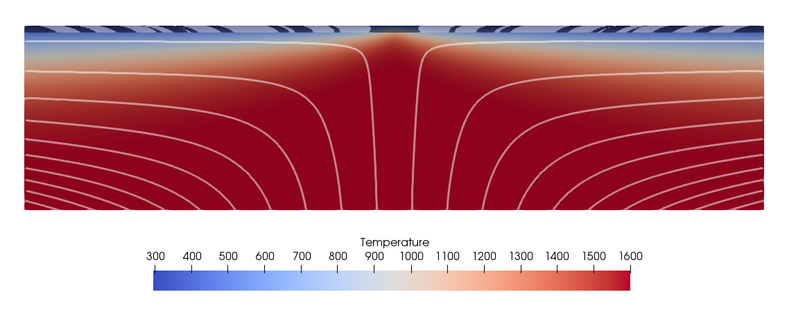

(sec:cookbooks:magnetic_stripes)=
# Magnetic lineations on the sea floor

*This section was contributed by Juliane Dannberg.*

The input file for this model can be found at
[cookbooks/magnetic_stripes/magnetic_stripes.prm](https://www.github.com/geodynamics/aspect/blob/main/cookbooks/magnetic_stripes/magnetic_stripes.prm).

This is a model of a mid-ocean ridge that shows how magnetic lineations are
created on the sea floor as the magnetic field changes its orientation over
time. The model setup is similar to the heat flow model described in {ref}`sec:cookbooks:heat-flow`. The only difference is that the
model also has a compositional field that tracks the orientation of the
magnetic field when material reaches the surface at the ridge axis in the
center of the model (and correspondingly, a value of 1 or -1 is assigned to
the field). As the material is advected away from the ridge axis, alternating
stripes -- symmetric with respect to the ridge axis -- become
visible.

This functionality is implemented through a new material model called magnetic
stripes. This material model allows it to add a list of reversal times to the
input file, that will then be used during the simulation. The input file used
here contains the Earth's reversal history of the last 83 million years.

Before the model can be run, the plugin needs to be compiled (see {ref}`sec:benchmark-run`). To illustrate the stripes forming on
the sea floor, a high resolution is necessary, which means that this cookbook
needs longer to run than some of the others, and it may not always be feasible
to run it on student laptops, or at least not during class. An animation can
be found [here](https://www.youtube.com/watch?v=KeHNhWLL7ws). Slides with an introduction to the Earth's magnetic
field can be found [here](https://www.dropbox.com/s/2kkw3ce2muvn4nh/08_geophysics_lecture_02_05.pdf?dl=0).


```{figure-md} fig:magnetic-stripes


 Setup of the mid-ocean ridge model. Background colors show temperature. Black and white colors at the top of the model illustrate the orientation of the magnetic field frozen in the rock when the melt generated at the mid-ocean ridge reaches the surface, crystallizes to form new sea floor, and the rock cools down. White lines illustrate the flow field.
```
