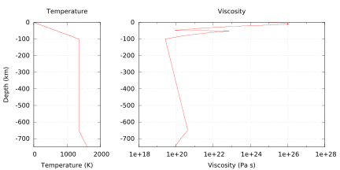

# Reproducing rheology of Morency and Doin, 2004

*This section was contributed by Jonathan Perry-Houts.*

Modeling interactions between the upper mantle and the lithosphere can be
difficult because of the dynamic range of temperatures and pressures involved.
Many simple material models will assign very high viscosities at low
temperature thermal boundary layers. The pseudo-brittle rheology described in
{cite:t}`morency:doin:2004` was developed to limit the strength of lithosphere at
low temperature. The effective viscosity can be described as the harmonic mean
of two non-Newtonian rheologies:
```{math}
v_{\text{eff}} = \left(\frac{1}{v_{\text{eff}}^v}+\frac{1}{v_{\text{eff}}^p}\right)^{-1}
```
where
```{math}
\begin{aligned}
  v_{\text{eff}}^v = B \left(\frac{\dot{\epsilon}}{\dot{\epsilon}_\text{ref}}\right)^{-1+1/n_v}
  \exp\left(\frac{E_a +V_a \rho_m g z}{n_v R T}\right),
  \\
  v_{\text{eff}}^p = (\tau_0 + \gamma \rho_m g z) \left( \frac{\dot{\epsilon}^{-1+1/n_p}}
  {\dot{\epsilon}_\text{ref}^{1/n_p}} \right),
\end{aligned}
```
where $B$ is a
scaling constant; $\dot{\epsilon}$ is defined as the quadratic sum of the
second invariant of the strain rate tensor and a minimum strain rate,
$\dot{\epsilon}_0$; $\dot{\epsilon}_\text{ref}$ is a reference strain rate;
$n_v$, and $n_p$ are stress exponents; $E_a$ is the activation energy; $V_a$
is the activation volume; $\rho_m$ is the mantle density; $R$ is the gas
constant; $T$ is temperature; $\tau_0$ is the cohesive strength of rocks at
the surface; $\gamma$ is a coefficient of yield stress increase with depth;
and $z$ is depth.

By limiting the strength of the lithosphere at low temperature, this rheology
allows one to more realistically model processes like lithospheric
delamination and foundering in the presence of weak crustal layers. A similar
model setup to the one described in {cite:t}`morency:doin:2004` can be reproduced
with the files in the directory [cookbooks/morency_doin_2004](https://www.github.com/geodynamics/aspect/blob/main/cookbooks/morency_doin_2004). In
particular, the following sections of the input file are important to
reproduce the setup:

:::{note}
{cite:t}`morency:doin:2004` defines the second invariant of the strain rate in a nonstandard way. The formulation in the paper is given as $\epsilon_{II} = \sqrt{\frac{1}{2}
(\epsilon_{11}^2 + \epsilon_{12}^2)}$, where $\epsilon$ is the strain rate tensor. For consistency, that is also the formulation implemented in ASPECT. Because of this irregularity it is inadvisable to use this material model for purposes beyond reproducing published results.
:::

:::{note}
The viscosity profile in Figure 1 of {cite:t}`morency:doin:2004` appears to be wrong. The published parameters do not reproduce these viscosities; it is unclear why. The values used here get very close. See {numref}`fig:md-1` for an approximate reproduction of the original figure.
:::

```{literalinclude} morency_doin.part.prm
```

```{figure-md} fig:md-1


Approximate reproduction of figure 1 from <span class="citation" data-cites="MD04">{cite:t}`morency:doin:2004`</span> using the "morency doin" material model with almost all default parameters. Note the low-viscosity Moho, enabled by the low activation energy of the crustal component.
```
