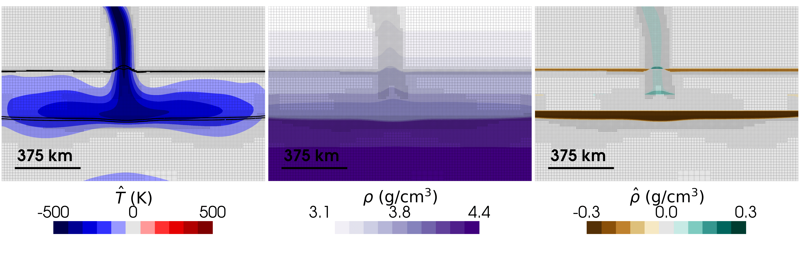
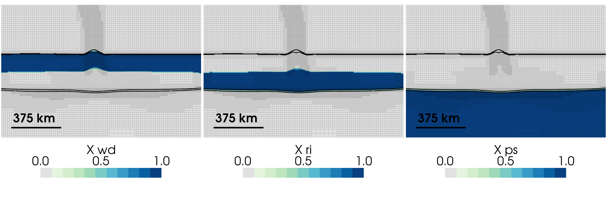
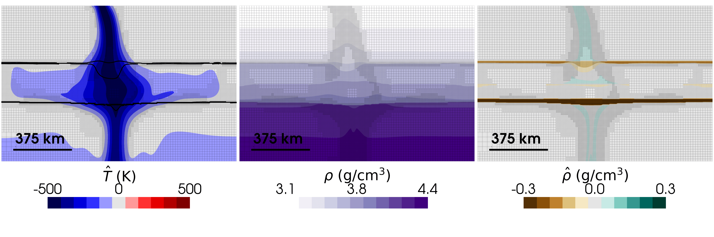

```{tags}
category:cookbook
feature:2d
feature:cartesian
feature:compositional-fields
feature:compressibility
feature:nonlinear-solver
```

(sec:cookbooks:mtz-kinetics)=

# Using Kinetics to Drive Phase Transformations in ASPECT

_Buchanan Kerswell, Rene Gassmöller, and Robert Myhill contributed this cookbook._

This cookbook is an extension and follow-up to the *[Using Non-Equilibrium Thermodynamics to Drive Phase Transformations](https://aspect-documentation.readthedocs.io/en/latest/user/cookbooks/cookbooks/phase_transition_kinetics/doc/phase-transition-kinetics.html)* cookbook. You can find the material model and input parameter file for this cookbook at [https://github.com/geodynamics/aspect/tree/main/cookbooks/mtz_kinetics](https://github.com/geodynamics/aspect/tree/main/cookbooks/mtz_kinetics).

## Overview

This cookbook demonstrates how to model phase transitions in a simple subduction model using reaction kinetics rather than equilibrium thermodynamics. It defines a [`MTZKinetics`](https://github.com/geodynamics/aspect/blob/main/cookbooks/mtz_kinetics/mtz-kinetics.h) material model that governs phase transitions across Earth's Mantle Transition Zone (MTZ) using local PT conditions and semi-empirical kinetic rate laws following the (site-saturated) nucleation-and-growth framework of {cite:t}`cahn:1956`, with experimental constraints from {cite:t}`kubo:2002` and {cite:t}`hosoya:2005`. This approach allows metastable phases to persist beyond their equilibrium reaction boundaries wherever local kinetic conditions are too sluggish (relative to the timescale of advection) to keep pace with changing PT conditions.

The distinction between ("instantaneous") equilibrium and ("lagged") metastable reactions matters because metastability generates its own buoyancy forces that can change flow behavior compared to what equilibrium thermodynamics would predict {cite:p}`kerswell:2026a`. In this simple subduction example, cold material flows from the top boundary of a 2D box at a fixed temperature and velocity. The model domain is initialized with pure-Mg olivine, wadsleyite, ringwoodite, and bridgmanite + periclase (the "postspinel" assemblage), which may become metastable and fundamentally change how slabs sink through the MTZ.

## Reaction Kinetics in ASPECT

### Sequencing Individual Phase Transitions

Individual phase transitions are sequenced using the [`ReactionChain`](https://github.com/geodynamics/aspect/blob/main/include/aspect/material_model/reaction_model/reaction_chain.h) class, which chains together an arbitrary (linear, non-branching) series of reactions: phase$_0$ &rarr; phase$_1$ &rarr; ... &rarr; phase$_N$. The [`ReactionChain`](https://github.com/geodynamics/aspect/blob/main/include/aspect/material_model/reaction_model/reaction_chain.h) is configured with a list of [`Kinetic models`](https://github.com/geodynamics/aspect/tree/main/include/aspect/material_model/reaction_model/kinetics) and corresponding lists of reaction-specific kinetic parameters (e.g., `Kinetic prefactors`, `Activation energies`) that govern how fast each reaction proceeds.

Current kinetic models include [`InterfaceControlledGrowth`](https://github.com/geodynamics/aspect/blob/main/include/aspect/material_model/reaction_model/kinetics/cahn1956_interface_controlled_growth.h) and [`EutectoidDecomposition`](https://github.com/geodynamics/aspect/blob/main/include/aspect/material_model/reaction_model/kinetics/cahn1956_eutectoid_decomposition.h), which are relevant for the phase transitions in this cookbook (see the `.prm` file below for this worked example). Additional kinetics models relevant to other planetary problems are expected to be added over time.

### Kinetic Models and Driving Forces

Rather than explicitly prescribing (univariant) equilibrium reaction boundaries for each major phase transition in Earth's MTZ, the [`MTZKinetics`](https://github.com/geodynamics/aspect/blob/main/cookbooks/mtz_kinetics/mtz-kinetics.h) material model formulates phase transitions as functions of kinetic prefactors (material constants), a Arrhenius temperature terms with a reaction-dependent activation energy, excess Gibbs energy of reactions, and the amount of reactants still available for each reaction. This kinetics framework is all contained within a single [`ReactionChain`](https://github.com/geodynamics/aspect/blob/main/include/aspect/material_model/reaction_model/reaction_chain.h) object, which is set up once in the parameter (`.prm`) file.

Following the site-saturated nucleation-and-growth framework of {cite:t}`cahn:1956`, the forward reaction rate between $A$ &rarr; $B$ evolves as:

```{math}
:label: eqn:reaction-rate-general

\frac{dX_B}{dt} = N\,\dot{x}\,(1-X_B)
```

where $X_B$ is the cumulative (forward) reaction progress, $N$ is a geometric factor accounting for grain-boundary nucleation sites, and $\dot{x}$ is a reaction-specific growth rate that depends on the kinetic model. Two kinetic models are implemented as interchangeable plugins that interface with the [`ReactionChain`](https://github.com/geodynamics/aspect/blob/main/include/aspect/material_model/reaction_model/reaction_chain.h), combining $N$ and $\dot x$ into a single macroscopic rate law.

- **[`InterfaceControlledGrowth`](https://github.com/geodynamics/aspect/blob/main/include/aspect/material_model/reaction_model/kinetics/cahn1956_interface_controlled_growth.h)** (after {cite:t}`hosoya:2005`): for reactions where nucleation and interface migration (rather than long-range diffusion) are rate-limiting, e.g. olivine &rarr; wadsleyite and wadsleyite &rarr; ringwoodite:

  ```{math}
  :label: eqn:reaction-rate-interface

  \frac{dX_B}{dt} = Z\,T\,\exp\!\left(-\frac{H^{\ast} + P V^{\ast}}{R T}\right)\left(1 - \exp\!\left[-\frac{|\Delta G|}{RT}\right]\right)(1-X_B)
  ```

  where $Z$ is a kinetic prefactor (units: $\mathrm{s^{-1}\,K^{-1}}$), $H^{\ast}$ and $V^{\ast}$ are the activation enthalpy and volume of the reaction, and $R$ is the gas constant.

- **[`EutectoidDecomposition`](https://github.com/geodynamics/aspect/blob/main/include/aspect/material_model/reaction_model/kinetics/cahn1956_eutectoid_decomposition.h)** (after {cite:t}`kubo:2002`): for diffusion-controlled lamellar decomposition reactions, e.g. ringwoodite &rarr; bridgmanite + periclase:

  ```{math}
  :label: eqn:reaction-rate-eutectoid

  \frac{dX}{dt} = Z\,(-\Delta G)\,|\Delta G|\,\exp\!\left(-\frac{E^{\ast}}{RT}\right)(1-X)
  ```

  where $Z$ is a kinetic prefactor (units: $\mathrm{mol^2\,J^{-2}\,s^{-1}}$) and $E^{\ast}$ is the activation energy of diffusion. Note the quadratic dependence on the driving force $\Delta G$, in contrast to the exponential saturation used in [`InterfaceControlledGrowth`](https://github.com/geodynamics/aspect/blob/main/include/aspect/material_model/reaction_model/kinetics/cahn1956_interface_controlled_growth.h).

The kinetic models (e.g., [`InterfaceControlledGrowth`](https://github.com/geodynamics/aspect/blob/main/include/aspect/material_model/reaction_model/kinetics/cahn1956_interface_controlled_growth.h)) in ASPECT are agnostic to how the thermodynamic driving force $\Delta G$ is calculated. In this cookbook, the material model defines $\Delta G$ relative to an adiabatic reference state:

```{math}
:label: eqn:thermodynamic-driving-force

\Delta G = \Delta G_0 + \hat{P} \Delta V - \hat{T} \Delta S
```

where $\Delta G$ is excess Gibbs energy driving the phase transition, $\Delta G_0 = \Delta G_b - \Delta G_a$ is the difference in Gibbs energy between the reacting phases $a$ and $b$, $\Delta V = V_b - V_a$ and $\Delta S = S_b - S_a$ are the differences in molar volume and entropy of the phases, respectively, $\hat{P} = P - \bar{P}$ is the nonadiabatic ("dynamic") pressure, and $\hat{T} = T - \bar{T}$ is the nonadiabatic temperature. The thermodynamic variables $\Delta G_0$, $\Delta V$, and $\Delta S$ are evaluated along an isentropic adiabat ($\bar{P}$, $\bar{T}$) using the thermodynamic data and equations of state from {cite:t}`stixrude:lithgow-bertelloni:2011`.

## Simulation Examples

The simple subduction models below illustrate how the relative kinetics of the 410, 520, and 660 transitions control whether metastable olivine/wadsleyite/ringwoodite persists deep enough to interfere with, or even stall, the sinking slab.

The first set of figures uses relatively fast 410 and 520 kinetics ($Z_\mathrm{ol}$ = $Z_\mathrm{wd}$ = 1.4e+04) together with slow 660 kinetics ($Z_\mathrm{ri}$ = 1.6e-03). The slow postspinel reaction is unable to keep pace with the advecting slab, so metastable ringwoodite accumulates and the slab stalls at the 660.

```{figure-md} fig:simple-subduction-slow660-fields


Temperature and density fields for a simple subduction model with relatively fast 410/520 kinetics ($Z_\mathrm{ol} = Z_\mathrm{wd}$ = 1.4e+04) and slow 660 kinetics ($Z_\mathrm{ri}$ = 1.6e-03). Cold material flows from the top boundary at a fixed temperature and velocity. Because the postspinel reaction is too slow to keep pace with the advecting slab, metastable ringwoodite persists to depth and the slab stalls near the 660.
```

```{figure-md} fig:simple-subduction-slow660-phases


Mass fractions of wadsleyite, ringwoodite, and postspinel for the same model as {numref}`fig:simple-subduction-slow660-fields`.
```

The second set of figures uses relatively sluggish 410 and 520 kinetics ($Z_\mathrm{ol}$ = $Z_\mathrm{wd}$ = 2.0e+02) but fast 660 kinetics ($Z_\mathrm{ri}$ = 1.6e+03). Here the postspinel reaction runs essentially to completion as soon as material crosses the equilibrium boundary, but metastable olivine and wadsleyite significantly slow the slab before reaching the 660.

```{figure-md} fig:simple-subduction-fast660-fields


Temperature and density fields for a simple subduction model with relatively sluggish 410/520 kinetics and fast 660 kinetics ($Z_\mathrm{ri}$ = 1.6e+03). All other parameters are the same as in {numref}`fig:simple-subduction-slow660-fields`.
```

```{figure-md} fig:simple-subduction-fast660-phases


Mass fractions of wadsleyite, ringwoodite, and postspinel for the same model as {numref}`fig:simple-subduction-fast660-fields`.
```

## Assumptions and Limitations

The kinetic models in ASPECT (implemented via [`ReactionChain`](https://github.com/geodynamics/aspect/blob/main/include/aspect/material_model/reaction_model/reaction_chain.h)) carry a number of simplifying assumptions, discussed at length in {cite:t}`kerswell:2026a` and {cite:t}`kerswell:2026b`:

**Linear, non-branching chains only:** [`ReactionChain`](https://github.com/geodynamics/aspect/blob/main/include/aspect/material_model/reaction_model/reaction_chain.h) supports a single linear sequence of phase transitions (phase$_0$ &rarr; phase$_1$ &rarr; ... &rarr; phase$_N$), each governed by its own cumulative reaction progress field $\xi_i$ with enforced ordering $1 \geq \xi_0 \geq ... \geq \xi_{N-1} \geq 0$. Branching reaction networks, or systems where more than one reaction produces or consumes the same phase, would require a stoichiometry-matrix mass balance approach that is out of scope for the current implementation.

**Symmetric, bidirectional rate laws:** Both [`InterfaceControlledGrowth`](https://github.com/geodynamics/aspect/blob/main/include/aspect/material_model/reaction_model/kinetics/cahn1956_interface_controlled_growth.h) and [`EutectoidDecomposition`](https://github.com/geodynamics/aspect/blob/main/include/aspect/material_model/reaction_model/kinetics/cahn1956_eutectoid_decomposition.h) treat the forward and reverse reactions symmetrically (the sign of $\Delta G$ simply flips which phase is being consumed). In practice, reverse reactions (e.g. ringwoodite regrowth from the postspinel assemblage in upwelling material) can proceed at meaningfully different rates than the forward reaction, particularly at lower temperatures; this asymmetry is not currently captured.

**No latent heat feedback on the reaction rate:** [`MTZKinetics`](https://github.com/geodynamics/aspect/blob/main/cookbooks/mtz_kinetics/mtz-kinetics.h) does not feed the latent heat of reaction back into the $\hat T$ term of Equation {math:numref}`eqn:thermodynamic-driving-force`, and computes $\alpha$, $\beta$, and $\mathrm{Cp}$ as simple mass-fraction-weighted ("isomorphic") averages of the endmember values rather than including the additional "metamorphic" terms that arise when phase proportions change with pressure and temperature. [`MTZKinetics`](https://github.com/geodynamics/aspect/blob/main/cookbooks/mtz_kinetics/mtz-kinetics.h) therefore underestimates the effective bulk $\alpha$, $\beta$, and $\mathrm{Cp}$, and should not be combined with the [`PhaseFunction`](https://github.com/geodynamics/aspect/blob/4a0743e738e65c3c8b371b4e8579e304f855ec0d/include/aspect/material_model/utilities.h#L756) class or other material models that assume instantaneous equilibrium (e.g. the [`Steinberger`](https://aspect-documentation.readthedocs.io/en/latest/user/cookbooks/cookbooks/steinberger/doc/steinberger.html) or [`Latent heat`](https://aspect-documentation.readthedocs.io/en/latest/user/cookbooks/cookbooks/latent-heat/doc/latent-heat.html#latent-heat-benchmark) material models).

**Kinetic parameter uncertainty:** The activation energies and kinetic prefactors for most reactions between rock-forming minerals are completely unconstrained, and those reactions with existing experimental data (e.g., {cite:t}`kubo:2002`; {cite:t}`hosoya:2005`) have uncertainties spanning several orders of magnitude. Simulations using the kinetic models in ASPECT should therefore be interpreted as bracketing plausible kinetic regimes rather than reproducing realistic planetary conditions.

(sec:cookbooks:mtz-kinetics:prm)=

## Input Parameter (.prm) File

The [`simple-subduction.prm`](https://github.com/geodynamics/aspect/blob/main/cookbooks/mtz_kinetics/simple-subduction.prm) file sets up the simple subduction model shown in {numref}`fig:simple-subduction-slow660-fields` to {numref}`fig:simple-subduction-fast660-phases`. From top to bottom, these subsections include:

A set of global parameters for the solver and other settings.

```
# This cookbook illustrates the effects of growth kinetics on the olivine --> wadsleyite phase transition
# and diffusion-controlled kinetics on the ringwoodite --> postspinel phase transition.
# It features a simplified thermal slab, induced by cold material entering the model with a prescribed temperature.

set Output directory = $ASPECT_SOURCE_DIR/cookbooks/mtz_kinetics

set Dimension                     = 2
set Use years instead of seconds  = true
set End time                      = 100e+06
set Adiabatic surface temperature = 1706
set Surface pressure              = 2e+09
set Nonlinear solver scheme       = iterated Advection and Stokes
set Nonlinear solver tolerance    = 1e-04
set Use operator splitting        = true
set Max nonlinear iterations      = 100
set CFL number                    = 0.7
set Maximum time step             = 25e+04
set Resume computation            = auto
set Additional shared libraries   = $ASPECT_SOURCE_DIR/cookbooks/mtz_kinetics/libmtz-kinetics.so


subsection Formulation
  set Mass conservation    = projected density field
  set Temperature equation = real density
end

subsection Solver parameters
  subsection Stokes solver parameters
    set Linear solver tolerance             = 1e-6
    set GMRES solver restart length         = 200
    set Number of cheap Stokes solver steps = 5000
  end
end

subsection Discretization
  set Use locally conservative discretization      = true
  set Use discontinuous composition discretization = true
  set Use discontinuous temperature discretization = true
end
```

The 2D box geometry and initial mesh resolution, sized to include the 410, 520, and 660 km transitions.

```
subsection Geometry model
  set Model name = box

  subsection Box
    set X extent      = 1500e+03
    set Y extent      = 1000e+03
    set X repetitions = 3
    set Y repetitions = 2
  end
end

subsection Mesh refinement
  set Initial adaptive refinement        = 3
  set Initial global refinement          = 3
  set Time steps between mesh refinement = 10
end
```

A constant boundary velocity that flows from top to bottom.

```
subsection Boundary velocity model
  set Prescribed velocity boundary indicators = top:function, right x:zero velocity, left x:zero velocity, bottom x:zero velocity

  subsection Function
    set Variable names      = x, y
    set Function constants  = x0=617000, y0=1050000, dx=105655, dy=-226577, L=250e+03, W=28025, V=5e-02, A=5e+03
    set Function expression = V*(dx/L) * exp(-(((x-x0)*(-dy)+(y-y0)*dx)/L)^2/(2*W^2)) * 0.5*(1+tanh((L-((x-x0)*dx+(y-y0)*dy)/L)/A)); \
                              V*(dy/L) * exp(-(((x-x0)*(-dy)+(y-y0)*dx)/L)^2/(2*W^2)) * 0.5*(1+tanh((L-((x-x0)*dx+(y-y0)*dy)/L)/A))
  end
end
```

A compositional boundary condition that ensures the correct phase enters the model at each depth.

```
subsection Boundary composition model
  set List of model names                   = function
  set Fixed composition boundary indicators = top, right, bottom, left

  subsection Function
    set Variable names      = x, y
    set Function expression = (y<6.4080e+05 ? 1 : 0); \
                              (y<4.9385e+05 ? 1 : 0); \
                              (y<4.0027e+05 ? 1 : 0); \
                              3500
  end
end
```

A temperature field that models a cool lithospheric slab entering the model at the top boundary with a -500 K temperature difference from the adiabatic temperature.

```
subsection Initial temperature model
  set List of model names = adiabatic, function

  subsection Function
    set Variable names      = x, y
    set Function constants  = x0=617000, y0=1050000, dx=105655, dy=-226577, L=250e+03, W=28025, dT=-5e+02, A=5e+03
    set Function expression = dT * exp(-(((x-x0)*(-dy)+(y-y0)*dx)/L)^2/(2*W^2)) * 0.5*(1+tanh((L-((x-x0)*dx+(y-y0)*dy)/L)/A))
  end

  subsection Adiabatic
    subsection Function
      set Function expression = 0; 0; 0; 3500
    end
  end
end

subsection Heating model
  set List of model names = adiabatic heating, shear heating
end
```

An initial lithostatic pressure at the top boundary with a constant gravitational acceleration of 10 m/s$^2$

```
subsection Boundary traction model
  set Prescribed traction boundary indicators = bottom y:initial lithostatic pressure, right y:initial lithostatic pressure, left y:initial lithostatic pressure

  subsection Initial lithostatic pressure
    set Representative point = 0, 0
  end
end

subsection Gravity model
  set Model name = function

  subsection Function
    set Function expression = 0.0; -10.0
  end
end
```

The adiabatic conditions are computed from the initial composition model, which defines a four-layer mantle (olivine, wadsleyite, ringwoodite, postspinel with depth). The cumulative reaction-progress fields `xi_olivine_wadsleyite`, `xi_wadsleyite_ringwoodite`, and `xi_ringwoodite_postspinel` are each updated by their respective reaction rate with a separate "reaction" timestep that is smaller than the advection timestep (see {ref}`sec:benchmark:operator-splitting`). We use the projected density approximation {cite}`gassmoller:etal:2020` formulation of the continuity equation, which requires a prescribed `density_field`.

```
subsection Adiabatic conditions model
  subsection Compute profile
    set Number of points = 10000
  end
end

subsection Initial composition model
  set List of model names = function

  subsection Function
    set Variable names      = x, y
    set Function expression = (y<6.4080e+05 ? 1 : 0); \
                              (y<4.9385e+05 ? 1 : 0); \
                              (y<4.0027e+05 ? 1 : 0); \
                              3500
  end
end

subsection Compositional fields
  set Number of fields            = 4
  set Names of fields             = xi_olivine_wadsleyite, xi_wadsleyite_ringwoodite, xi_ringwoodite_postspinel, density_field
  set Compositional field methods = field, field, field, prescribed field
end
```

The [`MTZ kinetics`](https://github.com/geodynamics/aspect/blob/main/cookbooks/mtz_kinetics/mtz-kinetics.h) material model, configured with a [`ReactionChain`](https://github.com/geodynamics/aspect/blob/main/include/aspect/material_model/reaction_model/reaction_chain.h) of three sequential transitions. Each transition derives its thermodynamic driving force from an ASCII data file (containing columns for $\rho_a$, $\rho_b$, $\alpha_a$, $\alpha_b$, $\mathrm{Cp}_a$, $\mathrm{Cp}_b$, $\Delta G$, $\Delta V$, and $\Delta S$). The olivine &rarr; wadsleyite and wadsleyite &rarr; ringwoodite transitions use [`InterfaceControlledGrowth`](https://github.com/geodynamics/aspect/blob/main/include/aspect/material_model/reaction_model/kinetics/cahn1956_interface_controlled_growth.h) (after {cite:t}`hosoya:2005`); the ringwoodite &rarr; postspinel transition uses [`EutectoidDecomposition`](https://github.com/geodynamics/aspect/blob/main/include/aspect/material_model/reaction_model/kinetics/cahn1956_eutectoid_decomposition.h) (after {cite:t}`kubo:2002`).

```
subsection Material model
  set Model name = MTZ kinetics

  subsection MTZ kinetics
    set Phase viscosity prefactors  = 1.0, 1.0, 1.0, 1.0

    set Viscosity                  = 1e+21
    set Minimum viscosity          = 1e+19
    set Maximum viscosity          = 1e+24
    set Thermal viscosity exponent = 5
    set Gibbs viscosity width      = 1e+03

    set Data directory  = $ASPECT_SOURCE_DIR/cookbooks/mtz_kinetics/data/
    set Data file names = olivine-wadsleyite-profile-Mg100.tsv|wadsleyite-ringwoodite-profile-Mg100.tsv|ringwoodite-postspinel-profile-Mg100.tsv

    set Use dynamic pressure correction for density = false
    set Use dynamic pressure correction for Gibbs   = false

    subsection Reaction chain
      set Kinetic models = Interface controlled growth|Interface controlled growth|Eutectoid decomposition

      subsection Interface controlled growth
        set Kinetic prefactors    = 2.0e+02|2.0e+02
        set Activation enthalpies = 274e+03|274e+03
        set Activation volumes    = 3.3e-06|3.3e-06
      end

      subsection Eutectoid decomposition
        set Kinetic prefactors    = 1.6e+03
        set Activation energies   = 355e+03
      end
    end
  end
end
```

To reproduce the scenarios in {numref}`fig:simple-subduction-fast660-fields`, adjust the kinetic prefactors entries under [`InterfaceControlledGrowth`](https://github.com/geodynamics/aspect/blob/main/include/aspect/material_model/reaction_model/kinetics/cahn1956_interface_controlled_growth.h) and [`EutectoidDecomposition`](https://github.com/geodynamics/aspect/blob/main/include/aspect/material_model/reaction_model/kinetics/cahn1956_eutectoid_decomposition.h) in the [`ReactionChain`](https://github.com/geodynamics/aspect/blob/main/include/aspect/material_model/reaction_model/reaction_chain.h) subsection (see example values above, or try your own).

Finally, the model output settings define how to write the solution for visualization.

```
subsection Postprocess
  set List of postprocessors = visualization

  subsection Visualization
    set Output format                 = vtu
    set Time between graphical output = 1e+06
    set Number of grouped files       = 1
    set List of output variables      = depth, material properties, adiabat, nonadiabatic temperature, nonadiabatic pressure, stress, shear stress, strain rate, stress second invariant, named additional outputs

    subsection Material properties
      set List of material properties = density, thermal expansivity, compressibility, specific heat, viscosity
    end

    subsection Principal stress
      set Use deviatoric stress = true
    end
  end
end

subsection Checkpointing
  set Time between checkpoint = 300
end
```
