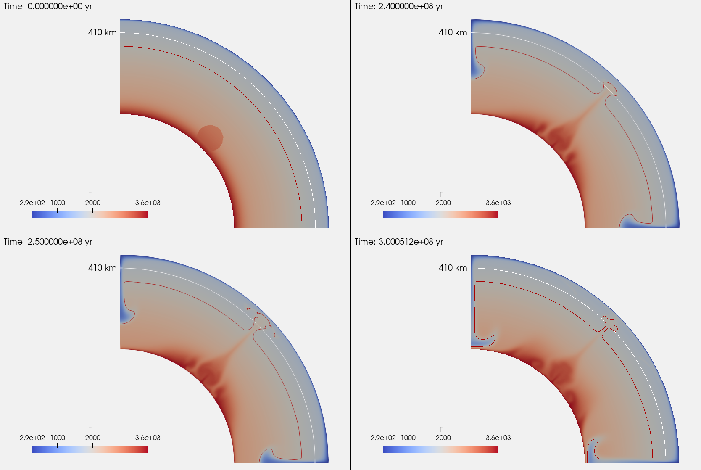
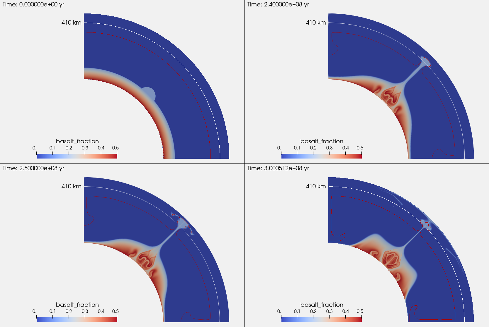
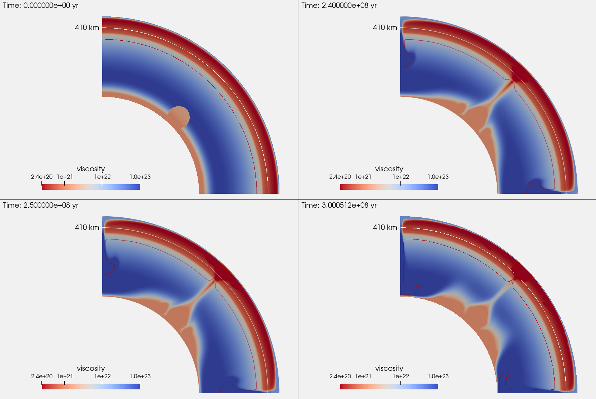

(sec:cookbooks:multicom_steinberger)=
#  Thermochemical plume model using multiple P--T look-up tables

*This section was contributed by Qianyi Lu.*

This cookbook simulates the evolution of a thermochemical plume similar
to what has been done in {cite:t}`Dannberg:Sobolev:2015`. It is also an example
of how to use multiple look-up tables in the `Steinberger Material model`.

:::{seealso}
See {ref}`sec:cookbooks:steinberger` for a more detail discussion of the
`Steinberger Material model`, the format of the look-up table, and the viscosity
structure of the model.
:::

## The look-up tables used in this cookbook.

Our material model uses two look-up tables, one for the pyrolitic ambient mantle,
and the other for the recycled oceanic crust accumulated at the CMB. The pyrolitic
look-up table can be found at
[data/material-model/steinberger/pyr_MS95_with_volume_fractions_lo_res.dat](https://www.github.com/geodynamics/aspect/blob/main/data/material-model/steinberger/pyr_MS95_with_volume_fractions_lo_res.dat).
The basaltic look-up table can be found at [data/material-model/steinberger/morb_G13_with_volume_fractions_lo_res.dat](https://www.github.com/geodynamics/aspect/blob/main/data/material-model/steinberger/morb_G13_with_volume_fractions_lo_res.dat).
These look-up tables are computed using Perple_X {cite}`connolly:2005`, a mineral
physics software, and are based on the thermodynamic database of {cite:t}`stixrude:lithgow-bertelloni:2011`.
They assume a pyrolitic composition {cite}`mcdonough:sun:1995` and a basaltic composition
{cite}`gale:etal:2013`.

The resolution of these two look-up tables is very low (every 2 GPa and 100 K)
so they should only be used for testing, but not for research applications.
You can generate a higher resolution look-up table using `Perplex`,
see <http://www.perplex.ethz.ch/> and [contrib/perplex/README.md](https://github.com/geodynamics/aspect/blob/main/contrib/perplex/README.md).

## General model setup.

The model setup is a quarter spherical shell with all free slip boundaries.
Setting the side boundaries to be periodic as in {ref}`sec:cookbooks:steinberger`
would cause the thermochemical anomaly to drift along the bottom boundary layer,
which is not desired for this model. The boundary temperature, gravity, and
heating model of this model setup are identical to those in {ref}`sec:cookbooks:steinberger`.
The key differences between this cookbook and {ref}`sec:cookbooks:steinberger`
appear in the `Initial temperature model`, `Compositional fields`, and
`Initial composition model`. We are going to go through how to set up
the input parameters file stey by step.

## Set up the compositional field and initial composition model.

The first thing we need to do is to specify how many compositional fields are
used in the model. Here, we use one compositional field representing the basaltic
materials and the background field is defaulted to be pyrolitic materials. We name this field as `basalt_fraction` and set it to be a `chemical composition field`.

```{literalinclude} comp.field.prm
```

The Material model setup is similar to "steinberger.prm" except that we have
N+1 material files for N compositional fields. The material files are ordered
as "background, field#1, field#2, ..." For intermediate composition values,
material properties will then be averaged based on the mass/volume fractions
of the individual compositions.

```{literalinclude} lookup.part.prm
```

Our initial composition setup is similar to Supplementary Figure 2b in
{cite:t}`Dannberg:Sobolev:2015`.  By varying the fraction of the compositional
field, we can prescribe a basal layer with 50% basaltic materials at the CMB and
gradually decrease to 15% at 500 km above the CMB. The percentage of the basaltic
materials is determined by a linear function:
```{math}
f(radius) = c + k * radius,
```
where $k = -7e-7 m^{-1}$ is the slope of the line, $c = 2.9367$, and $radius$
is the distance from the center to a given point in $m$. You can modify $k$
and $c$ to prescribe a different distribution of basaltic material in the basal
layer. On top of the basal layer, we prescribe a 400-km-radius circular
compositional anomaly with 15% basalt if it is above the basal
layer. Where the anomaly overlaps with basal layer, the
composition is taken from the basal layer. All the other areas of the model domain are set to be 100%
pyrolite ({numref}`fig:compfield.multicompstn`:top left).

```{literalinclude} comp.setup.prm
```
:::{note}
The percentage of basaltic materials of the circular anomaly should equal to
the percentage of basaltic materials at the top of the basal layer to prevent
a composition discontinuity between the basal layer and the circular anomaly.
:::

## Set up the initial temperature model to enable a coupled thermochemical basal layer and anomaly.

To be consistent with the model setup in {cite:t}`Dannberg:Sobolev:2015` (see
Supplementary Figure 2a) and the mantle processes, we would like an initial
temperature field that is coupled with the initial composition field. That is,
we want a hot mixture of basalt and pyrolite within the basal layer, with a circular
anomaly that has an excess temperature appropriate for a mantle plume. The initial
temperature field should also be consistent with the adiabatic temperature
profile in the model.

Our model has a `adiabatic surface temperature` of 1600 K. By using `List of model names`
instead of `Model names` and specifying `List of model operators = add`, we
are able to add the function expression and the boundary temperature model
expression to the adiabatic temperature profile.

We use the half-space cooling model to set up a 50 Ma top boundary layer and
a 700 Ma bottom boundary layer. We use `Function` to prescribe a circular
thermal anomaly at the same position and with the same size as the compositional
anomaly. The temperature of the anomaly is the maximum value between 450 K and
the temperature difference between the actual temperature profile and the ambient
mantle adiabat. This setup produces a thermal anomaly with an excess
temperature of 450 K that deviates from the bottom thermal boundary layer smoothly
({numref}`fig:temperature.multicompstn`:top left).
```{literalinclude} temperature.setup.prm
```
Since we need to use the heat capacity, density, and thermal conductivity to
calculate the thermal diffusivity (function constant `kappa`) and NONE of these values is constant, you should choose values that are representative for the model's bottom boundary layer. You can do it by first setting `End time = 1`
and running the model. You then find the representative heat capacity, density, and thermal conductivity values for your model from the visualization output. The heat capacity and density are obtained from the look-up tables, whereas the thermal conductivity is pressure-temperature dependent, which is set in the `material model`.
```{literalinclude} conductivity.setup.prm
```
Other than `kappa`, other constants used in the `Function`, the adiabatic bottom temperature (`Tab`)and the age of the bottom thermal boundary layer (`age`), should also be consistent with the adiabatic temperature setup of the model.

You may also notice that there is a `subsection Function` under `subsection Adiabatic`, which has the same expression as the basal layer prescribed in `Initial composition model/Function`. Because the adiabat of the ambient mantle is computed using the thermal properties in the two look-up tables based on the basalt fraction, by using the same function expression, we could compute an initial mantle adiabat that is consistent with the chemical composition. If the `Function express` is set to `0`, the mantle adiabat will be computed assuming the composition is  100% of the background materials (pyrolite in our case). This function expression should have the same number of terms as the `Number of fields` set in the
`Compositional fields`. Please see [ASPECT forum discussion](https://community.geodynamics.org/t/there-is-a-problem-when-use-initial-temperature-model-adiabatic-half-space-cooling-with-number-of-composition-greater-than-1-ascii-model/3160/2) for more information.


The complete input file can be found in
[cookbooks/multicomponent_steinberger/doc/steinberger_thermochemical_plume.prm](https://github.com/geodynamics/aspect/blob/main/cookbooks/multicomponent_steinberger/steinberger_thermochemical_plume.prm).

## Results

We run the model for 300 million years. A primary plume rises from the initial thermochemical anomaly to the base of the lithosphere after ~250 Myrs. The thermochemical plume penetrates the 410 km buoyancy barrier broadly and spreads out at ~410 km depth. Our model results are consistent with the results from {cite}`Dannberg:Sobolev:2015`. However, due to the mid-mantle viscosity hump ({numref}`fig:viscosity.multicompstn`) present in our model but not in {cite:t}`Dannberg:Sobolev:2015`, the plume in our model rises much slower than the plumes in {cite:t}`Dannberg:Sobolev:2015`. In addition, since this is a 2D model whereas the {cite:t}`Dannberg:Sobolev:2015` models are axisymmetric around the plume center, the plume tail in our model can entrain less material and is therefore much thinner. You may need to adjust the reference
viscosity profile, change the model geometry to 3D, and/or adjust the buoyancy (by changing the size or temperature) of the initial thermochemical anomaly to get similar results to {cite:t}`Dannberg:Sobolev:2015`.

Also note that the cold downwellings that develop in this model push the initial dense layer at the base of the mantle into a pile of basaltic material, and the structure of thermochemical pile continues to evolve as the model runs. They can resemble the process of subducted slabs sweeping the accumulated basaltic material into a pile and may eventually drive new plumes to rise from the edges of the pile. New plumes may also originate from random locations either inside or outside the pile. The first plume that rises only represents a transient state of the model, and plumes that rise at later points in time might look different. For a research application model to fully understand the dynamics of thermochemical plumes, one may want to run the model for a longer time in a full spherical shell. The interpretations should be based on the dynamics of plumes after the initial transient phase.

```{figure-md} fig:temperature.multicompstn


 Temperature field of the model at 0, 240, 250, and 300 Ma. The white line represents 410 km depth. The red line is the contour of 1900 K.
```

```{figure-md} fig:compfield.multicompstn


 Basaltic material fraction at 0, 240, 250, and 300 Ma. The white line represents 410 km depth. The red line is the contour of 1900 K.
```
```{figure-md} fig:viscosity.multicompstn


 Viscosity field of the model at 0, 240, 250, and 300 Ma. The white line represents 410 km depth. The red line is the contour of 1900 K.
```
