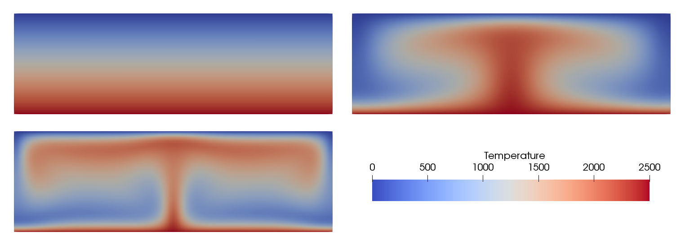

(sec:cookbooks:onset_of_convection)=
# Onset of convection

*This section was contributed by Juliane Dannberg.*

The input file for this model can be found at
[cookbooks/onset_of_convection/onset_of_convection.prm](https://www.github.com/geodynamics/aspect/blob/main/cookbooks/onset_of_convection/onset_of_convection.prm).

This model is a copy of the onset of convection benchmark described in {ref}`sec:benchmarks:onset_of_convection`, with the difference
that parameter values are specified explicitly in the input file (rather than
through an ipython notebook). The setup is based on a linear stability
analysis for the onset of convection given in {cite:t}`turcotte:schubert:2014` (section 6.19). The parameters being used here are
reasonable for the Earth's mantle. The cookbook folder contains a script
[cookbooks/onset_of_convection/run.sh](https://www.github.com/geodynamics/aspect/blob/main/cookbooks/onset_of_convection/run.sh) that can be used to run several
models with small parameter variations. More details can be found in the
example assignment below.


```{figure-md} fig:onset-of-convection-models


 Onset of convection model with different Rayleigh numbers. Background colors show temperature.
```

Slides that describe the different forces controlling convective motion (which
is related to one of the questions in the assignment) can be found [here]( https://www.dropbox.com/s/0wqtg05w7713hdz/06_geophysics_lecture_01_29.pdf?dl=0).

## Example assignment: Onset of convection in celestial bodies

*This section describes an example for a homework assignment based on this
cookbook.*

### How to setup and run the models

In this assignment, you will analyze the likelihood of mantle convection in a
celestial body.

### Pick a celestial body.

In order to do that, pick a celestial body from the list in Section 3. You can
also pick one that is not on my list, as long as you can convincingly argue
that it is made of rock or ice rather than gas (gases have such a low
viscosity that their physical behavior is quite different, and we can assume
that a planetary body made of gas always convects). I have also listed
estimates for the thickness of the mantle for each celestial body (if you pick
your own, you will have to figure out an approximate value for the mantle
thickness). We will assume that most material properties are the same as for
the Earth. Exceptions are the viscosity (which you will vary as part of the
model) and the density/thermal conductivity: In case your body is made of ice,
you need to change the density in the input file to 1000 kg/m<sup>3</sup> and
the thermal conductivity to 2.5 W/(m K). To do that, modify the line

        set Reference density             = 1000
        set Thermal conductivity          = 2.5

(changing the reference density from 4000 to 1000 kg/m<sup>3</sup>, and the
thermal conductivity from 4.0 to 2.5 W/(m K).)

### Compute the gravity.

In addition, you will need to change the gravity. Smaller bodies, and ones
with a lower density will have a lower gravity. You can assume that the
gravity is constant within your celestial mantle (which is an approximation
that may be better or worse depending on the body you picked, but we will go
with it for simplicity), and compute the gravitational acceleration using the
formula:
```{math}
g = \frac{G M}{r^2}
```
where $G = 6.67430 \times 10^{-11}$ m<sup>3</sup> kg<sup>-1</sup>
s<sup>-2</sup> is the gravitational constant, $M$ is the mass of the body you
picked and $r$ is the radius of the body you picked (both of which you can
easily find online).

To change the gravity, modify the line

        set Magnitude = 10.0

in the `Gravity model` subsection to the value you have computed. The units
are m/s<sup>2</sup>.

### Prepare the model runs.

You can find a file called `run.sh` in the [cookbooks/onset_of_convection/](https://www.github.com/geodynamics/aspect/blob/main/cookbooks/onset_of_convection/)
folder. This file is not a model input file, but it is a bash script than can
run a set of models rather than just one model. It uses the input file
[cookbooks/onset_of_convection/onset_of_convection.prm](https://www.github.com/geodynamics/aspect/blob/main/cookbooks/onset_of_convection/onset_of_convection.prm), modifies some of
the parameter values, and then runs it with ASPECT. To see what is in the
file, you can open it with leafpad.

You will notice that close to the top of the file, there is a line that
specifies the thickness of the mantle in the model. This value is used in more
than one place in the input file, so it is easier to let the script replace
all occurrences than to do this by hand. To use your mantle thickness, replace
the value in the line

    mantle_thickness=3000000

The other lines you will have to modify are the following:

    for viscosity in "1e24" "3.3e24" "1e25" "3.3e25" "1e26" "3.3e26" "1e27"
    do
      for DeltaT in "10" "30" "100" "300" "1000" "3000" "10000"
      do

What happens here is that the script performs a loop (a so-called for-loop):
It executes all the commands within the loop for each of the values listed
here in quotes. In other words, this loop would run the model for all
combinations of the viscosities $10^{24}$, $3.3 \cdot 10^{24}$, $10^{25}$,
$3.3 \cdot 10^{25}$, $10^{26}$, $3.3 \cdot 10^{26}$, $10^{27}$ Pa s, and the
temperature differences of 10, 30, 100, 300, 1000, 3000 and 10000 K between
top and bottom of the model (which is what the DeltaT parameter stands for).
Given the large number of models, they are only run for 2 time steps each.

You can start with the original values in the script, but if you find that
either almost all or almost none of your models have convection, you will have
to modify these ranges so that you can map the boundary of where convection
starts. The more models you run, the easier it will be to see the trend in the
results, so feel free to increase the number of values in the loops once you
have found a parameter range that includes both models with and without
convection.

### Run the models.

To run the script, you need to type

    bash run.sh ../../build/aspect

(Or, if the executable is in a different directory, you need to replace
`../../build/aspect` by that path.)

This will create a subfolder with the visualization output of each model run
in the [cookbooks/onset_of_convection/](https://www.github.com/geodynamics/aspect/blob/main/cookbooks/onset_of_convection/) folder, and it will also create the
file `onset-convection-data.csv`. This file contains a line for each model run
that provides the viscosity (first column), the temperature difference between
top and bottom of the model (second column), the average velocity of the
second-to-last time step (third column) and the average velocity of the last
time step (last column). The last two columns can help you to decide if the
model is unstable (perturbations in temperature will grow over time and lead
to convection) or stable (perturbations in temperature will decay over time
and no convection will take place). In an unstable model, the velocity should
grow after the first time step, in a stable model, the velocity should
decrease.

### Postprocess the output.

You can plot the `onset-convection-data.csv` file using gnuplot (or a
different plotting program, if there's one you like better). The
[cookbooks/onset_of_convection/](https://www.github.com/geodynamics/aspect/blob/main/cookbooks/onset_of_convection/) folder should also contain a file
`plot.plt`. This is a small script for gnuplot that will generate a plot from
your data and write it into an output file called `convection.png`, using
logarithmic scales for the x and y axes. The script is already set up in a way
that it plots the ratio of the last two columns in the data file (which are
the average velocities in the model in the last two times steps), so it will
plot values larger than 1 (shown in yellow colors) for unstable model
configurations, and values smaller than one (shown in black colors) for stable
model configurations without convection. Note that the gnuplot algorithm draws
quadrangles filled with colors calculated from the average color-value of the
surrounding 4 corners.

You can run the script by typing

    gnuplot plot.plt

You can open [cookbooks/onset_of_convection/plot.plt](https://www.github.com/geodynamics/aspect/blob/main/cookbooks/onset_of_convection/plot.plt) with leafpad to see
what's in there, and you can also run each of these lines as a separate
command interactively in gnuplot. In order to do that, type `gnuplot` in the
terminal, and then just copy or type any of the commands in the terminal
window (but that's optional; hint: to close gnuplot, type `quit`).

Vary your input parameters until you have a plot that clearly shows a boundary
between models without and with convection. The temperatures should be in a
reasonable range (you can check the densities in the visualization output in
ParaView, if you have negative densities, your temperature is too large).

### Visualize the convective behavior.

Now that you know for what parameters convection starts, run a model series of
3 models for a longer time. Pick one parameter combination of temperature
variation (we will call it `temperature_value` in the script below) and
viscosity (we will call it `value1` in the script below) that only just has a
small enough viscosity to be unstable. Use this combination, then a viscosity
that is an order of magnitude lower than `value1`, and a viscosity that is two
orders of magnitude lower than `value1` (keeping the temperature the same).

In order to do that, you can modify the file `run.sh` in the
[cookbooks/onset_of_convection/](https://www.github.com/geodynamics/aspect/blob/main/cookbooks/onset_of_convection/) folder in the following way:

    for viscosity in "value1" "value2" "value3"
    do
      for DeltaT in "temperature_value"
      do

where value1, value2 and value3 should be replaced by your three viscosity
values, and temperature_value by your value for the temperature variation
across the mantle. In addition, you need to change the line

        echo "  set End step                             = 2" >> temp.prm

to

        echo "  set End step                             = 100" >> temp.prm

This will make the model run 100 time steps instead of just 2.

You will use these models to analyze how the style of convection changes as
the forces controlling convection move further away from being equal, as
outlined below.

### What should be in your report?

### Start with an introduction.

Start with an introductory paragraph that states what you want to do and gives
an outlook on the rest of the report.

### Describe your model setup.

In your report, start by describing the setup of the model and what can be
learned from running such a model. Specifically, describe what the important
forces are that drive and resist convection including the corresponding
equations. Also discuss the material properties that affect these forces, and
why the temperature is important even though it does not show up in the force
balance.

State what celestial body you investigate, the vertical extension and the
gravity you use in your model.

### Describe your model results.

Then describe your model results. Include your plot of models with and without
convection for different values of the viscosity and temperature difference
and discuss it: What parameter range did you test? How do variations in each
of the two parameters influence the occurrence of convection? Describe how the
line of the onset of convection (i.e., the interface between the part of your
plot with and the one without convection) depends on both parameters: Is this
a linear relation between both parameters? In other words, could the interface
be expressed in form of an equation that is linear, i.e. temperature variation
= constant $\cdot$ viscosity? (Remember that the plot has axes with a
logarithmic scale!) For an Earth-like temperature variation across the mantle
of your celestial body, what viscosity would be required for convection to be
likely?

### Bonus question

Find an approximate equation for the line of the onset of convection in the
plot. Relate it to the forces acting in the model: Why does the equation
depend on the two parameters in this way?

I have to admit that I found this difficult to do in gnuplot, so you could for
example pick all of the points in your data file that are closest to the line
of onset of convection (the ones where the velocity changes the least), copy
them to a table, plot them as an x-y scatter plot in a software like Excel or
Libre Office Calc and then use this software to plot a best-fitting line,
including it's equation. Remember that any constants in the equation
will have units.

Describe how the style of convection changes when you decrease the viscosity.
Include screenshots of the last model time steps of the three models with
different viscosities you let evolve for a longer time as described above.
What happens to the shape of plumes and slabs as the viscosity becomes
smaller? What happens to the model velocity?

### Discuss the predictions of your model.

Based on the temperature and viscosity values you determined would be needed
for the onset of convection in your celestial body, and how they compare to
the viscosities and temperatures in the Earth, do you expect that your
celestial body has mantle convection today? If your results show that there
are reasonable parameter combinations that would predict convection, but also
reasonable parameters that would not predict convection, you can also argue
that with the information we have, we can not say if the body would have
mantle convection. That is a valid conclusion.

### Bonus question

Discuss what evidence, surface features or observations could potentially
indicate that a body has active mantle convection. Is there any evidence for
the body you picked? Can you think of a reason why a celestial body would have
convection even though the models do not predict it?

### Finish with a conclusion

Summarize your results and any new insights you gained by running the models
and analyzing them.

### List of celestial bodies

-   Mercury Mercury's mantle has a thickness of 500--700 km
    (<https://en.wikipedia.org/wiki/Mercury_(planet)#Internal_structure>. You
    can pick any value within this range.

-   Venus The mantle of Venus has a thickness of approximately 2800 km
    (<https://solarsystem.nasa.gov/planets/venus/in-depth/>).

-   Mars The Martian mantle has a thickness of approximately 1550 km
    (<https://en.wikipedia.org/wiki/Mars#Internal_structure>).

-   The Moon The Moon's mantle has a thickness of 1350 km
    (<https://moon.nasa.gov/about/what-is-inside-the-moon/>).

-   Pluto Pluto has a rocky core with a diameter of approximately 1700 km, and
    an icy crust of approximately 200 km thickness
    (<https://en.wikipedia.org/wiki/Pluto>); you can study the likelihood of
    convection in either of these.

-   Europa The Jupiter moon Europa has a vast and deep ocean that is
    considered the most promising place to look for life beyond Earth
    (<https://solarsystem.nasa.gov/moons/jupiter-moons/europa/in-depth/>). The
    exact size and composition of Europa's iron-rich core is unknown,
    but on this NASA image it looks like the mantle could be on the order of
    1000 km thick
    (<https://europa.nasa.gov/resources/113/interior-of-europa/>).

-   Io Io is the innermost of Jupiter's moons and has more than 400
    active volcanoes. A simple model
    (<http://volcano.oregonstate.edu/inside-io>) suggests that Io's core
    takes up about half of its radius, leaving a mantle thickness of
    approximately 900 km.

-   Titan Titan, the largest moon of Saturn, possibly has a rocky core made of
    hydrous silicates with a thickness of approximately 2000 km
    (<https://www.nasa.gov/mission_pages/cassini/multimedia/titan20120223L.html>).

-   Exoplanets There may be "rocky" planets outside of the solar
    system. A list can be found here:
    <https://en.wikipedia.org/wiki/List_of_nearest_terrestrial_exoplanet_candidates>.
    It also lists the mass and radius of the planets, which you will need to
    compute their gravity field. We don't really know what they are made
    of, but for simplicity, let's assume that they have a silicate
    mantle and the same ratio between mantle and core radius as the Earth,
    which means you can compute the mantle thickness as 0.45 $\cdot$ planetary
    radius.

### Where to find more information

### Input parameters, their units and their meaning

All input parameters are documented here:
<https://aspect.geodynamics.org/doc/parameter_view/parameters.xml>. If you are
unsure what an input parameter means, or what its units are, there is a search
field at the top where you can type in the parameter you want to know more
about. The website will expand all of the subsections that contain a parameter
with that name (sometimes, parameters like 'Viscosity' appear in
more than one subsection, because they can be used as part of different
material descriptions, in this case you have to pick the one that is in the
same subsection as the one in your input file). If you click on the parameter,
it will show a documentation of the parameter, including its units.

### ParaView

You can download a ParaView guide from here:
<https://www.paraview.org/paraview-downloads/download.php?submit=Download&version=v5.7&type=data&os=Sources&downloadFile=ParaViewGuide-5.7.0.pdf>.
I realize the guide is 260 pages long, so it is not very helpful if you start
out learning ParaView and want to learn basic functionality, but is mostly
useful if you remember that, for example, there was a filter called
'Stream Tracer,' but forgot what all of its different options are.
In that case you can go to the section of the manual that describes the
'Stream Tracer' filter and how to use it. If you want a recap on
the basic functionality, there is a short video tutorial on YouTube:
<https://www.youtube.com/watch?v=Y1RATo2swM8>. But please don't use the
rainbow color scale as he does! It has been shown to be misleading, in the
sense that it can make it look like there are features in the data that are
not really there, and that it can hide other, real features in the data.

### Gnuplot

gnuplot is a command-line drive graphics program for linux. First: If you know
a way to make the same type of plot I ask you to create below with a different
program, that is completely fine too! I will explain the steps for how to make
the plot in gnuplot, but this is just one possible option. You can find more
information and help on what commands there are in gnuplot here:
<http://www.gnuplot.info/>. They have a lot of examples (that can be found
under Demos) that show you how a given plot will look like and the code to
create a plot like this. But if there is a specific command I don't
know, I usually just google something like "gnuplot how do I change the
x axis to log scale" to find the answer.

I like gnuplot because it allows you to quickly redo a plot even if the data
have changed: If you just execute the same lines in gnuplot again, but with a
new data file, you will get a plot in the same style as with the original
data, for example with regard to axis labels, color scales, fitting lines to
data, etc. That is the advantage of using a command-line tool rather than a
graphical tool, and can be very useful, for example, when you write a
publication and a reviewer (or a collaborator, or adviser) asks you to run new
models, but redo the same plots.
