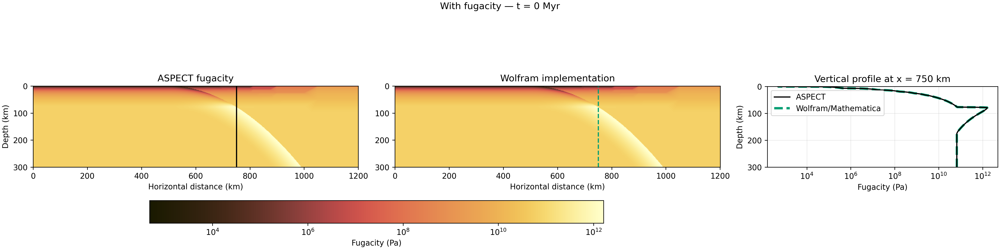
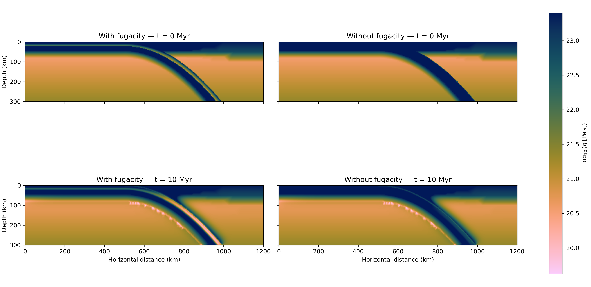

```{tags}
category:cookbook
feature:2d
feature:cartesian
feature:compositional-fields
feature:plasticity
setting:subduction
```

(sec:cookbooks:peng-robinson-fugacity)=
# Water-fugacity weakening with the Peng-Robinson equation of state

*This section was contributed by Ana C. Gomes.*

The input files for this cookbook are
[cookbooks/peng_robinson_fugacity/peng-robinson-fugacity.prm](https://www.github.com/geodynamics/aspect/blob/main/cookbooks/peng_robinson_fugacity/peng-robinson-fugacity.prm)
and
[cookbooks/peng_robinson_fugacity/peng-robinson-no-fugacity.prm](https://www.github.com/geodynamics/aspect/blob/main/cookbooks/peng_robinson_fugacity/peng-robinson-no-fugacity.prm).
They provide otherwise identical models with and without water-fugacity weakening. Both use the [visco-plastic material model](https://github.com/geodynamics/aspect/blob/main/source/material_model/visco_plastic.cc), assume incompressibility, and represent the different materials using advected compositional fields rather than particles.

This cookbook demonstrates how to:

1. configure the `peng_robinson76_fugacity` viscosity-prefactor scheme,

2. expose the calculated fugacity through the named additional material output `fugacity`, and

3. compare an otherwise identical pair of models to isolate the effect of fugacity on crustal viscosity.

## Model setup and boundary conditions

The model is a two-dimensional, 1200 km wide and 300 km deep box containing an oceanic plate, a curved slab, and an overriding plate. The crust forms a 20 km thick layer at the top of the oceanic plate and follows the slab through its bend. The overriding plate is 80 km thick. The mesh has a maximum resolution of 3 km on and around the crust.

Temperature is fixed to the initial temperature on the left,  bottom, and top boundaries; the right boundary is thermally  insulating. The slab and overriding plate begin with 80 km  thick linear geotherms from 273 K at their surfaces to 1573 K  in the mantle. The asthenospheric mantle is initialized at 1573 K.

The boundary composition model uses the same layering as the initial composition. The velocity is prescribed in the oceanic lithosphere throughout the simulation. It then enters through the left boundary at 2 cm/yr, moves horizontally through the flat part of the model, follows the local slab dip through the bend, and leaves the model where the slab intersects the bottom boundary. At every timestep, the velocity is zero outside the prescribed oceanic-lithosphere and slab region, so the overriding plate and mantle background remain stationary.

This kinematic setup keeps the example inexpensive while retaining a geometry in which pressure and temperature vary along the slab. 

The models are run for 10 Myr so that the prescribed initial temperature field can adjust through advection and thermal diffusion and the resulting evolution of fugacity and viscosity can be compared.

## Peng-Robinson fugacity

Fugacity is the effective pressure of a real fluid and accounts for non-ideal fluid behavior. The model assumes water-saturated conditions. Consequently, the adiabatic pressure is used as the fluid pressure. The `peng_robinson76_fugacity` calculates the fugacity of a configurable fluid from pressure and temperature using the Peng-Robinson equation of state introduced by {cite:t}`peng:robinson:1976`. The default thermodynamic parameters describe water. The pressure supplied to the equation of state is limited to 2.5 GPa because fugacity behavior is not constrained above that pressure.

The default thermodynamic parameters describe water:

```{literalinclude} ../peng-robinson-fugacity.prm
:language: parameter
:start-at: set Viscosity prefactor scheme
:end-at: set Acentric factor
```

To apply the equation of state to another pure fluid, replace the **critical temperature**, **critical pressure**, and **acentric factor ($\omega$)** with values for that fluid. Peng and Robinson describe $\kappa$ as a constant characteristic of each substance and correlate it against the acentric factor in equation (18) of {cite:t}`peng:robinson:1976`. ASPECT uses that correlation:

```{math}
\kappa = 0.37464 + 1.54226\omega - 0.26992\omega^2.
```

In [ASPECT](https://github.com/geodynamics/aspect/blob/main/source/material_model/rheology/compositional_viscosity_prefactors.cc), the values of the universal Peng-Robinson coefficients 0.45724 and 0.07780, do not change for different fluids. 


The calculation can be checked independently against the {cite:t}`baumannFugacityEquationState2015` implementation of the Peng-Robinson equation for water presented . That implementation solves the compressibility-factor cubic analytically. The comparison below applies those equations at the temperature and adiabatic pressure of each ASPECT output point. For a direct implementation check, the independent calculation uses exactly the same constants and decimal precision as ASPECT: $R=8.3144621$ J mol$^{-1}$ K$^{-1}$, $a_0=0.45724$, and $b_0=0.07780$. Both implementations calculate $\kappa$ from the water acentric factor $\omega=0.344$, giving $\kappa=0.873236$. The demonstration itself exposes pressures only up to 30 MPa; here its published equations are evaluated up to the same 2.5 GPa pressure limit used by ASPECT.

```{figure-md} fig:peng-robinson-fugacity-field


Water fugacity at the initial timestep from ASPECT (left) and from the independent Wolfram/Mathematica implementation (center). The solid black and dashed green vertical lines mark the profile location at $\sim x=750$ km. The corresponding ASPECT and Wolfram/Mathematica profiles overlap across the full model depth (right). The profile becomes nearly vertical below approximately 77 km, where the pressure supplied to the equation of state reaches its 2.5 GPa limit.
```

In this example, diffusion creep is disabled. The dislocation-creep fugacity exponent $r/n$ is zero for the background and overriding plate and 0.25 for the crust. After applying the fugacity factor in Equation {math:numref}`eq:peng-robinson-viscosity-factor`, the visco-plastic material model performs its usual viscosity averaging and applies the configured viscosity limits and plastic yielding. The named additional output `fugacity` makes the calculated fugacity available for visualization.

```{literalinclude} ../peng-robinson-fugacity.prm
:language: parameter
:start-at: subsection Postprocess  
:end-before: subsection Solver parameters
```

Fugacity is independent of composition because it depends only on pressure and temperature. Its effect on viscosity can nevertheless be configured for each compositional field through the water-fugacity exponent.

The Peng-Robinson equation of state follows {cite:t}`peng:robinson:1976`. The independent water-fugacity comparison follows {cite:t}`baumannFugacityEquationState2015`. Experimental motivation for water weakening and its fugacity dependence is provided by {cite:t}`karatoRheologySyntheticOlivine1986` and {cite:t}`meiInfluenceWaterPlastic2000a`. The wet-quartz flow-law parameters used for the crust follow {cite:t}`tokle:etal:2019`.

For dislocation creep, the fugacity-dependent flow law can be written as

```{math}
:label: eq:peng-robinson-fugacity-flow-law

\dot{\varepsilon}_{II} = A f_{\mathrm{H_2O}}^r \sigma^n \exp\left(-\frac{E+PV}{RT}\right),
```

where $\dot{\varepsilon}_{II}$ is the second invariant of the strain rate in s$^{-1}$, $f_{\mathrm{H_2O}}$ is the water fugacity in Pa, $\sigma$ is the differential stress in Pa, and $P$ is pressure in Pa. The water-fugacity exponent $r$ and stress exponent $n$ are dimensionless. The dislocation-creep prefactor $A$ has units Pa$^{-(n+r)}$ s$^{-1}$ when fugacity and stress are both expressed in Pa. Finally, $E$ is the activation energy in J mol$^{-1}$, $V$ is the activation volume in m$^3$ mol$^{-1}$, $R$ is the gas constant in J mol$^{-1}$ K$^{-1}$, and $T$ is temperature in K. Solving Equation {math:numref}`eq:peng-robinson-fugacity-flow-law` for the effective viscosity $\eta$ in Pa s gives

```{math}
:label: eq:peng-robinson-fugacity-viscosity

\eta
= \frac{1}{2} A^{-1/n}
  \dot{\varepsilon}_{II}^{(1-n)/n}
  \exp\left(\frac{E+PV}{nRT}\right)
  f_{\mathrm{H_2O}}^{-r/n}.
```

ASPECT first calculates the part that does not contain fugacity,

```{math}
:label: eq:peng-robinson-base-viscosity

\eta_{\mathrm{base}}
= \frac{1}{2} A^{-1/n}
  \dot{\varepsilon}_{II}^{(1-n)/n}
  \exp\left(\frac{E+PV}{nRT}\right),
```

using `Prefactors for dislocation creep`, `Stress exponents for dislocation creep`, `Activation energies for dislocation creep`, and `Activation volumes for dislocation creep`. The Peng-Robinson viscosity-prefactor scheme then multiplies $\eta_{\mathrm{base}}$ by the weakening fugacity term.

```{math}
:label: eq:peng-robinson-viscosity-factor

\eta = \eta_{\mathrm{base}} f_{\mathrm{H_2O}}^{-r/n}.
```

:::{important}
ASPECT inserts the numerical values of fugacity and stress in Pa directly into the flow law. The units used for the creep-law prefactor $A$ must therefore also assume fugacity and stress in Pa. If a published flow law expresses both fugacity and stress in MPa, convert its prefactor according to

```{math}
A_{\mathrm{Pa}} = A_{\mathrm{MPa}}\left(10^{-6}\right)^{n+r}.
```

The input parameter `Water fugacity exponents for dislocation creep` controls the exponent applied directly to viscosity. Enter $r/n$ for this parameter, because ASPECT multiplies the base viscosity by $f_{\mathrm{H_2O}}^{-r/n}$. Do not enter the flow-law exponent $r$ by itself.
:::

The wet-quartz dislocation-creep parameters assigned to the crust follow {cite:t}`tokle:etal:2019`, with the prefactor converted to the SI units used by this model.

In the next section, we compare two models: one uses the Peng-Robinson viscosity weakening implementation (reference model), the other does not (comparison model). The comparison model does not use `Viscosity prefactor scheme` and associated Peng-Robinson parameters. All other physical and numerical parameters are the same, so differences between the two solutions isolate the influence of the fugacity-dependent viscosity factor.

## Effect on the brittle--ductile transition

Including the fugacity factor substantially lowers the oceanic-crust viscosity. Consequently, the transition from frictional or plastic behavior to viscous deformation moves to shallower depths. This effect is not confined to the deeply subducted part of the slab: in the flat incoming plate, even the lower crust is sufficiently weak to deform viscously. In comparison, the comparison without fugacity retains a stronger crust and places the brittle-ductile transition at greater depth.

```{literalinclude} ../peng-robinson-fugacity.prm
:language: parameter
:start-at: set Angles of internal friction 
:end-before: end
```

```{figure-md} fig:peng-robinson-fugacity-viscosity


Viscosity for the models with and without Peng-Robinson water-fugacity weakening at the initial timestep (top) and after 10 Myr (bottom).
```

## Assumptions and limitations

This example is designed to illustrate one rheological effect, rather than to represent a dynamically self-consistent subduction zone. In particular:

- Water-saturated conditions are assumed everywhere. The model does not track
  water content, dehydration reactions, fluid migration, or loss of fluid
  from the slab.

- Adiabatic pressure is used as a proxy for fluid pressure. Dynamic pressure,
  compaction pressure, and departures from hydrostatic pore-fluid pressure do
  not influence fugacity.

- The default critical properties and acentric factor describe water. The parameters
  can describe a different pure fluid as explained above, but fluid mixtures
  and fluid--rock chemical interactions are not included.

- The 2.5 GPa pressure limit prevents unconstrained extrapolation of the
  Peng-Robinson calculation. Below the depth where the limit is reached,
  fugacity can still vary with temperature, but not with further increases in
  adiabatic pressure.

- The model does not solve the Stokes equations. Instead, it uses the specified kinematic velocity and hydrostatic pressure functions. Fugacity weakening
  therefore changes the calculated viscosity and yielding behavior, but it
  cannot alter the slab speed, slab geometry, or mantle circulation.
- The model without fugacity is a numerical control that removes only the
  $f_{\mathrm{H_2O}}^{-r/n}$ multiplier. It should not be interpreted as a
  separately calibrated dry-quartz flow law. 

These assumptions make the comparison inexpensive and easy to interpret, but they should be revisited before using the setup to make quantitative predictions for a natural subduction zone.

## Running and visualizing the models

Run the two models from the ASPECT source directory with:

```bash
mpirun -np 4 ./aspect \
  cookbooks/peng_robinson_fugacity/peng-robinson-fugacity.prm

mpirun -np 4 ./aspect \
  cookbooks/peng_robinson_fugacity/peng-robinson-no-fugacity.prm
```

The model with fugacity writes to `output-peng-robinson-fugacity`, and the reference model writes to `output-peng-robinson-no-fugacity`.

The visualization output contains `fugacity`, `viscosity`, `dislocation_viscosity`, temperature, pressure, composition, and yielding diagnostics. Plotting `fugacity` together with temperature and depth helps distinguish the temperature dependence from the pressure dependence. Comparing `viscosity` with `plastic_yielding` is useful for locating the brittle--ductile transition.

## Extending the model

Useful modifications to this cookbook include:

- Varying the oceanic-crust value of `Water fugacity exponents for
  dislocation creep` to quantify its influence on weakening.

- Changing the incoming plate temperature or thermal thickness to examine how
  the thermal structure controls fugacity and the brittle--ductile transition.

- Replacing the prescribed Stokes solution with a dynamically solved velocity
  field so that rheological weakening can affect the subduction flow.
