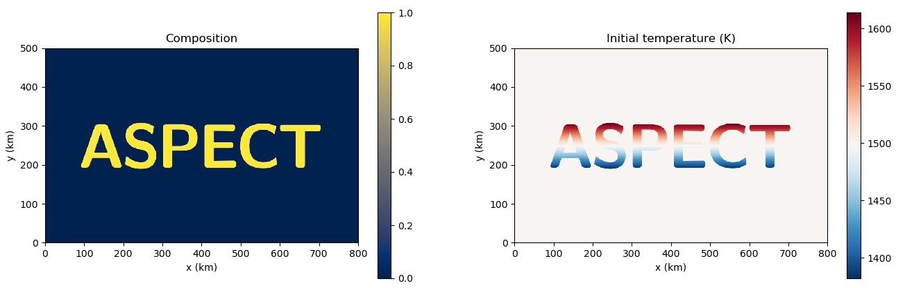
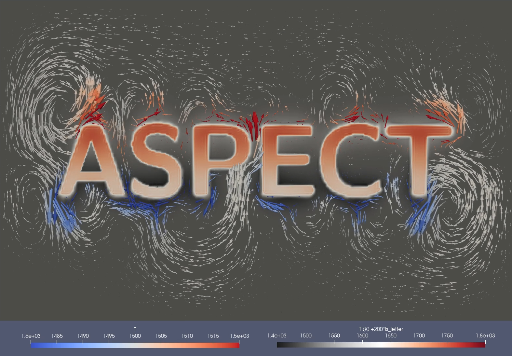

(sec:cookbooks:prescribed_velocity_ascii)=
# Prescribing internal velocity constraints with ASCII files

*This section was contributed by Bob Myhill.*

Building on {ref}`sec:cookbooks:prescribed_velocity`, the
[cookbooks/prescribed_velocity_ascii_data](https://www.github.com/geodynamics/aspect/blob/main/cookbooks/prescribed_velocity_ascii_data) directory contains a plugin which
uses an ASCII data file to specify where to prescribe internal velocities.
Velocities are prescribed wherever the field value indicated by the ASCII data
file is greater than 0.5. As before, the plugin is loaded in parameter files
as an additional shared library:

```{literalinclude} prescribed_velocity_ascii_data.prm.0.out
```

An example parameter file using this plugin can be found at
[cookbooks/prescribed_velocity_ascii_data/prescribed_velocity_ascii_data.prm](https://www.github.com/geodynamics/aspect/blob/main/cookbooks/prescribed_velocity_ascii_data/prescribed_velocity_ascii_data.prm).
In this file, the velocities are constrained to be zero within the letters
"ASPECT" ({numref}`fig:prescribed-velocity-ascii-data-init`). The part of this file which provides
the location of the ASCII file and the prescribed velocity field function is:

```{literalinclude} prescribed_velocity_ascii_data.prm.1.out
```

A temperature gradient is applied within the letters, while the temperature
field outside the letters is set to be constant. This initial temperature
field is specified by another ASCII data file:

```{literalinclude} prescribed_velocity_ascii_data.prm.2.out
```

These two ASCII data files are generated from `aspect_name.png` by the python
file `make_ascii_files_from_png.py`, both of which can be found in the same
directory as the parameter file.

```{figure-md} fig:prescribed-velocity-ascii-data-init


 Initial composition and temperature conditions for the prescribed velocity ascii data cookbook, as described in {ref}`sec:cookbooks:prescribed_velocity_ascii`.
```

During the simulation, excess heat diffuses out from the tops of the letters,
and into the bases of the letters. The temperature gradients in the
unconstrained part of the domain then generate convective flow.
{numref}`fig:prescribed-velocity-ascii-data` illustrates the resulting flow field.

```{figure-md} fig:prescribed-velocity-ascii-data


 Convective flow around the letters ASPECT, within which velocities are prescribed to be zero, as described in {ref}`sec:cookbooks:prescribed_velocity_ascii`.
```
