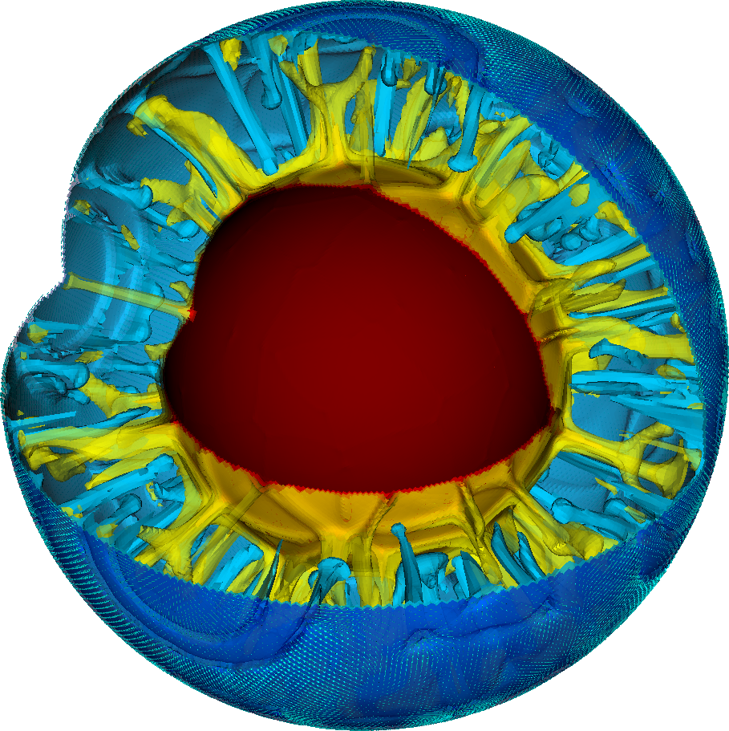
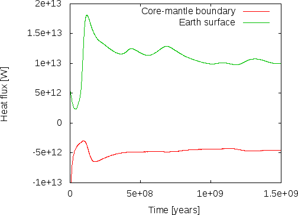

(sec:cookbooks:shell_simple_3d)=
# Simple convection in a spherical 3d shell

The setup from the previous section can of course be extended to 3d shell
geometries as well -- though at significant computational cost. In fact,
the number of modifications necessary is relatively small, as we will discuss
below. To show an example up front, a picture of the temperature field one
gets from such a simulation is shown in {numref}`fig:simple-shell-3d`. The corresponding
movie can be found at <http://youtu.be/j63MkEc0RRw>.

```{figure-md} fig:simple-shell-3d


 Convection in a spherical shell: Snapshot of isosurfaces of the temperature field at time $t\approx 1.06\times10^{9}$ years with a quarter of the geometry cut away. The surface shows vectors indicating the flow velocity and direction.
```

## The input file.

Compared to the input file discussed in the previous section, the number of
changes is relatively small. However, when taking into account the various
discussions about which parts of the model were or were not realistic, they go
throughout the input file, so we reproduce it here in its entirety,
interspersed with comments (the full input file can also be found in
[cookbooks/shell_simple_3d/shell_simple_3d.prm](https://www.github.com/geodynamics/aspect/blob/main/cookbooks/shell_simple_3d/shell_simple_3d.prm)). Let us start from the top
where everything looks the same except that we set the dimension to 3:

```{literalinclude} part1.part.prm
```

The next section concerns the geometry. The geometry model remains unchanged
at "spherical shell" but we omit the opening angle of 90 degrees
as we would like to get a complete spherical shell. Such a shell of course
also only has two boundaries (the inner one has indicator zero, the outer one
indicator one) and consequently these are the only ones we need to list in the
"Boundary velocity model" section:

```{literalinclude} part2.part.prm
```

Next, since we convinced ourselves that the temperature range from 973 to 4273
was too large given that we do not take into account adiabatic effects in this
model, we reduce the temperature at the inner edge of the mantle to 1973. One
can think of this as an approximation to the real temperature there minus the
amount of adiabatic heating material would experience as it is transported
from the surface to the core-mantle boundary. This is, in effect, the
temperature difference that drives the convection (because a completely
adiabatic temperature profile is stable despite the fact that it is much
hotter at the core mantle boundary than at the surface). What the real value
for this temperature difference is, is unclear from current research, but it
is thought to be around 1000 Kelvin, so let us choose these values.

```{literalinclude} part3.part.prm
```

The second component to this is that we found that without adiabatic effects,
an initial temperature profile that decreases the temperature from the inner
to the outer boundary makes no sense. Rather, we expected a more or less
constant temperature with boundary layers at both ends. We could describe such
an initial temperature field, but since any initial temperature is mostly
arbitrary anyway, we opt to just assume a constant temperature in the middle
between the inner and outer temperature boundary values and let the simulation
find the exact shape of the boundary layers itself:

```{literalinclude} part4.part.prm
```

As before, we need to determine how many mesh refinement steps we want. In 3d,
it is simply not possible to have as much mesh refinement as in 2d, so we
choose the following values that lead to meshes that have, after an initial
transitory phase, between 1.5 and 2.2 million cells and 50--75 million
unknowns:

```{literalinclude} amr.part.prm
```

Second to last, we specify what we want ASPECT to do with the solutions it computes.
Here, we compute the same statistics as before, and we again generate
graphical output every million years. Computations of this size typically run
with &nbsp;1000 MPI processes, and it is not efficient to let every one of
them write their own file to disk every time we generate graphical output;
rather, we group all of these into a single file to keep file systems
reasonably happy. Likewise, to accommodate the large amount of data, we output
depth averaged fields in VTU format since it is easier to visualize:

```{literalinclude} postprocess.part.prm
```

Finally, we realize that when we run very large parallel computations, nodes
go down or the scheduler aborts programs because they ran out of time. With
computations this big, we cannot afford to just lose the results, so we
checkpoint the computations every 50 time steps and can then resume it at the
last saved state if necessary (see
Section&nbsp;{ref}`sec:checkpoint-restart`):

```{literalinclude} checkpoint.part.prm
```

## Evaluation.

Just as in the 2d case above, there are still many things that are wrong from
a physical perspective in this setup, notably the no-slip boundary conditions
at the bottom and of course the simplistic material model with its fixed
viscosity and its neglect for adiabatic heating and compressibility. But there
are also a number of things that are already order of magnitude correct here.

For example, if we look at the heat flux this model produces, we find that the
convection here produces approximately the correct number. Wikipedia's
article on [Earth's internal heat budget](http://en.wikipedia.org/wiki/Earth's_internal_heat_budget)[^footnote1] states that the overall
heat flux through the Earth surface is about $47\times10^{12}$ W (i.e., 47
terawatts) of which an estimated 12--30 TW are primordial heat released
from cooling the Earth and 15--41 TW from radiogenic heating.[^footnote2] Our
model does not include radiogenic heating (though ASPECT has a number of
`Heating models` to switch this on, see
{ref}`parameters:Heating_20model`) but we can compare what the
model gives us in terms of heat flux through the inner and outer boundaries of
our shell geometry. This is shown in {numref}`fig:shell-simple-3d-eval-1` where
we plot the heat flux through boundaries zero and one, corresponding to the
core-mantle boundary and Earth's surface. ASPECT always computes heat fluxes in
outward direction, so the flux through boundary zero will be negative,
indicating the we have a net flux *into* the mantle as expected. The figure
indicates that after some initial jitters, heat flux from the core to the
mantle stabilizes at around 4.5 TW and that through the surface at around 10
TW, the difference of 5.5 TW resulting from the overall cooling of the mantle.
While we cannot expect our model to be quantitatively correct, this can be
compared with estimated heat fluxes of 5--15 TW for the core-mantle
boundary, and an estimated heat loss due to cooling of the mantle of
7--15 TW (values again taken from Wikipedia).


```{figure-md} fig:shell-simple-3d-eval-1


 Evaluating the 3d spherical shell model. Outward heat fluxes through the inner and outer boundaries of the shell.
```

```{figure-md} fig:shell-simple-3d-eval-2


 Evaluating the 3d spherical shell model. Average and maximal velocities in the mantle.
```

A second measure of whether these results make sense is to compare velocities
in the mantle with what is known from observations. As shown in {numref}`fig:shell-simple-3d-eval-2`, the maximal velocities settle to values on the order
of 3 cm/year (each of the peaks in the line for the maximal velocity
corresponds to a particularly large plume rising or falling). This is, again,
at least not very far from what we know to be correct and we should expect
that with a more elaborate material model we should be able to get even closer
to reality.

[^footnote1]: Not necessarily the most scientific source, but easily accessible and
typically about right in terms of numbers. The numbers stated here are those
listed on Wikipedia at the time this section was written in March 2014.

[^footnote2]: As a point of reference, for the mantle an often used number for the
release of heat due to radioactive decay is $7.4\times 10^{-12}$ W/kg. Taking a
density of $3300\; \text{ kg}/\text{m}^3$ and a volume of $10^{12}\; \text{ m}^3$
would yield roughly $2.4\times 10^{13}$ W of heat produced. This back of the
envelope calculation lies within the uncertain range stated above.
