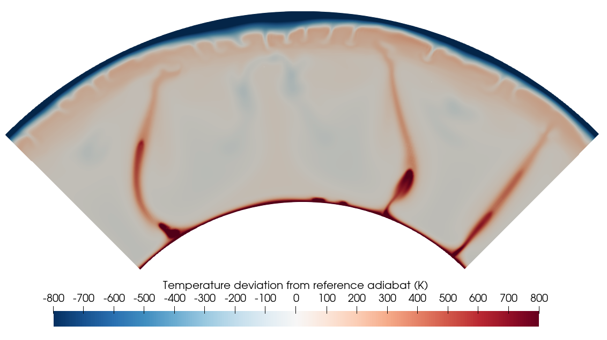
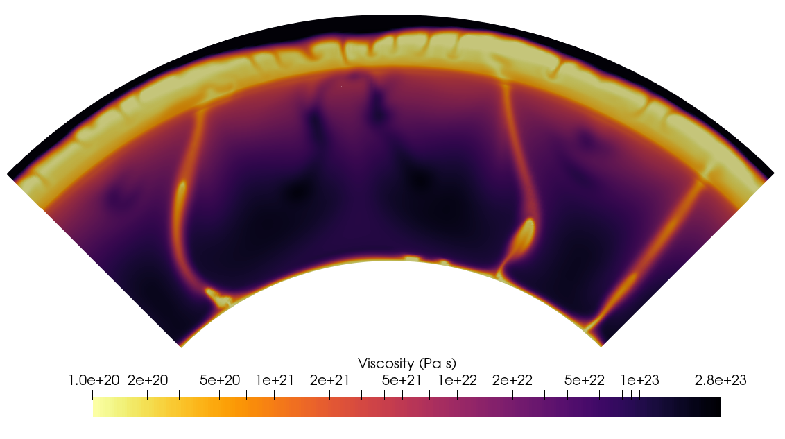
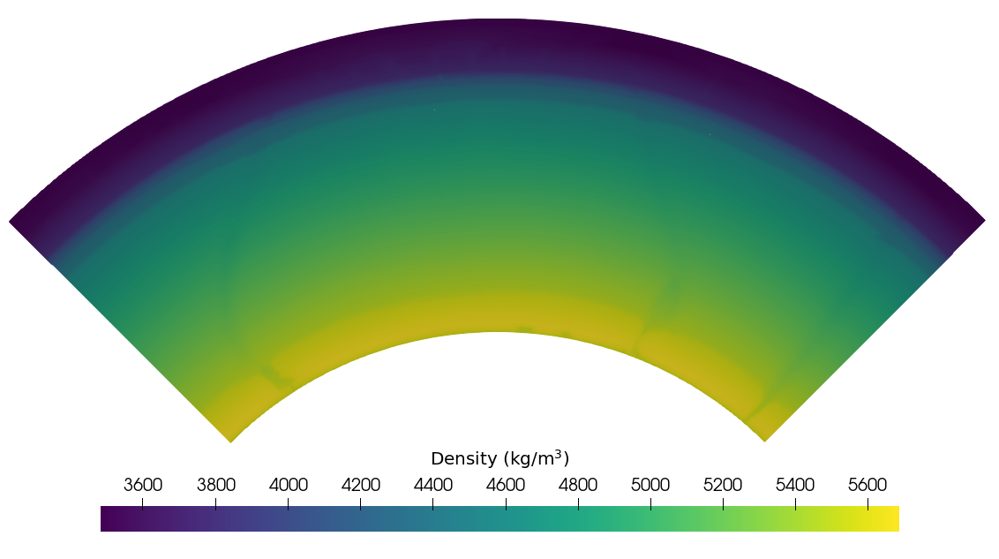
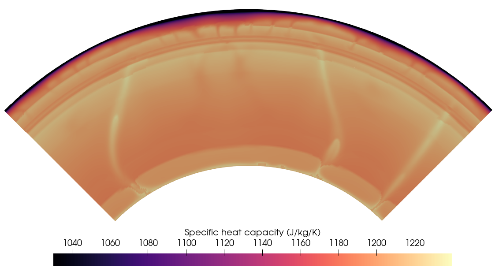

#### Convection using a pressure&ndash;temperature look-up table and the rheology of Steinberger and Calderwood (2006)

*This section was contributed by Juliane Dannberg and Ren&eacute;
Gassm&ouml;ller.*

In this cookbook we will go one step further from the last one and set up a
fully compressible mantle convection model using the projected density
approximation (where the density is interpolated onto the finite element grid
to compute the density gradients in the mass conservation equation rather than
approximating these gradients using a reference profile or
temperature/pressure derivatives of the density, see (Gassm&ouml;ller et al.
2020)). To compute the material properties, we read in a look-up table of
material properties in dependence of temperature and pressure, originally
computed using a mineral physics software (in this case, Perple_X, (Connolly
2005)). The table is based on the thermodynamic database of (Stixrude and
Lithgow-Bertelloni 2011) and a pyrolitic composition (Ringwood and Irifune
1988). Compared to a 1D profile, a temperature-pressure look-up table has the
advantage that material properties are accurate not only around one reference
adiabat, but also for strongly deviating pressures and temperatures. This is
particularly important at phase transitions, because their depth depends on
the temperature and pressure.

This cookbook also demonstrates how to read in a viscosity profile from a data
file. Specifically, we use the profile and lateral viscosity variations due to
temperature from (Steinberger and Calderwood 2006), which are based on mineral
physics constraints and surface observations.

In addition, this cookbook shows the use of periodic boundary conditions.

##### Geometry and periodic boundaries.

The model setup is a quarter spherical shell with periodic side boundaries.
The inner and outer radius are 3481&nbsp;km and 6371&nbsp;km, respectively, so
that the mantle is 2900&nbsp;km deep. In the same section of the input file,
we also need to specify that the model should have periodic boundaries in
angular ($\phi$) direction:

``` prmfile
```

Both the top and bottom boundaries allow for free slip. Because the model has
periodic side boundary conditions and free slip boundaries at top and bottom,
the amount of rigid-body rotation in $\phi$ direction is not constrained. In
other words: There is no unique solution. can remove this nullspace from the
model (see Section&nbsp;[\[sec:nullspace\]][1]). Here, we do this by setting
the net rotation to zero:

``` prmfile
```

The temperature is fixed to 273&nbsp;K at the top and 3773&nbsp;K at the
bottom boundary. The initial temperature model consists of an adiabatic
profile, thermal boundary layers at the surface and the core-mantle boundary,
and a small harmonic perturbation to initiate convection. The gravity profile
in the model is based on PREM.

##### The equation of state.

To use material properties from a temperature&ndash;pressure look-up table, we
use the Steinberger material model. We have to specify the path to the
directory where all the data files we want to use for this model are stored.
This includes the files for the viscosity profile, the lateral viscosity
variations due to temperature, and all material files containing look-up
tables computed by mineral physics software. In addition we have to specify
the names of these files. In our case, we only have one of these look-up
tables, because we only have one composition: pyrolite. But in principle, the
material model can use several compositions with one look-up table for each.
For intermediate composition values, material properties will then be averaged
based on the mass/volume fractions of the individual compositions.

In addition, there are a few options we can select about how these look-up
tables should be used: We can decide between interpolating between data points
in the lookup table based on the pressure and temperature at the point we need
the material properties for, or we can simply take the value from the table
that is closest. In our case, we choose the bilinear interpolation because it
is more accurate. Second, we can decide how latent heat should be computed:
from the thermal expansivity and specific heat, or from the enthalpy (all
three properties should be columns in the look-up table). In some cases the
look-up table contains the effective thermal expansivity and specific heat.
Using these effective properties automatically includes the latent heat
release and consumption at phase transformations in the adiabatic heating term
and the left-hand side term (change in thermal energy over time) of the energy
equation. In a case like that, we simply want to use these values without
using additional latent heat terms because latent heat is already included
automatically when using the properties from the look-up table. If the look-up
table contains thermal expansivity and specific heat without the effect of
phase transitions, then can compute latent heat effects based on the pressure
and temperature derivatives of the specific enthalpy (using the approach of
(Nakagawa et al. 2009)). In our case, we simply do not include latent heat at
all in our model. So the look-up table is computed without latent heat
effects, and we set the &ldquo;Latent heat&rdquo; parameter to `false`.

``` prmfile
```

In an actual research application, it would be appropriate (and consistent
with the projected density approximation, or any other compressible
approximation) to compute latent heat instead of neglecting it as we do. This
often leads to numerical instabilities that one typically addresses by
ensuring that either the resolution is fine enough so that each phase
transitions is resolved by several mesh cells, or the energy equations needs
to be solved for entropy instead of pressure (which is an option available in
; in this case, the look-up table needs to be given in terms of entropy and
pressure).

##### The look-up table format.

The format of these look-up tables is described in the documentation of the
[aspect::MaterialModel::MaterialUtilities::Lookup::MaterialLookup][] class.
Two different formats are currently supported: Perple_X and HeFESTo. The
format needs to be selected in the input file, and each format has a specific
header and needs to be structured in a specific way. The paragraph below
explains how to structure a Perple_X file. This file format is the default, it
is also the more flexible format and it is what is used in this cookbook.
Since the only requirements for the format are the header and the order of
some of the columns, files created with other mineral physics software can
also be converted to this format.

The Perple_X header contains the following in the first 13 lines:

1.  The Perple_X version,

2.  the name of the data table,

3.  the dimensions of the data table (for example, for a table with one
    dimension being pressure, the other temperature, this would be 2),

4.  the variable in the first dimension (this either needs to be `T(K)` for
    temperature, or `P(bar)` for pressure),

5.  the minimum value of this variable,

6.  the increments this variable will be increased with in the table,

7.  the number of different values of this variable the table contains,

8.  the second variable,

9.  the minimum value of this second variable,

10. the increments this second variable will be increased with in the table,

11. the number of different values of this second variable the table contains,

12. the number of material properties in the table, and finally,

13. the names of the columns.

The first two columns need to be the pressure and temperature (in any order).
The other required column names are: `rho,kg/m3` (for the density),
`alpha,1/K` (for the thermal expansivity), `cp,J/K/kg` (for the specific
heat), `vp,km/s` (for the P-wave velocity), `vs,km/s` (for the S-wave
velocity)), `h,J/kg` (for the specific enthalpy). Optionally, the file can
contain columns with the name `phase` (to read in the name of the dominant
phase), and columns named `vol_fraction_` and the name of a phase after the
second underscore (to read in volume fractions of different phases). As an
example, the header of the table used in this cookbook is given below:

    |6.6.6
    PYR-Ringwood88_2.tab
               2
    T(K)
       400.00360000000001
       19.999960000020000
             181
    P(bar)
       15001.334999999999
       5114.9322988556905
             262
               8
    T(K)           P(bar)         rho,kg/m3      alpha,1/K      cp,J/K/kg      vp,km/s        vs,km/s        h,J/kg

Below this header, the table contains the actual data values, using one column
for each of the property names given in the last line of the header. It is
also useful to know that does not actually read in the values of the pressures
and temperatures in the first two columns, but instead uses the minimum,
increment, and number of values parameters given in the header, assuming a
uniform step size. The first column is always assumed to be the inner loop
(i.e., it needs to increase first while the second column stays constant).

##### The rheology.

The rheology of this model consists of two parts: The viscosity profile, and
the lateral variations due to temperature. For each of these, we need to read
in a data file. In this example, we use files that are based on (Steinberger
and Calderwood 2006) for both. The viscosity profile is based on mineral
physics and surface constrains, and the lateral viscosity variations use an
Arrhenius law with a depth-dependent activation enthalpy. For more details and
a derivation, see (Steinberger and Calderwood 2006).

Other rheology models can be used by reading in different files. The
formatting of these files is the following: The radial viscosity file contains
two columns, where the first is the viscosity in Pa&nbsp;s, and the second is
the depth in km (note that this is an exception to the usual convention of
using SI units). The lateral viscosity file also contains two columns, the
first being the activation enthalpy divided by the gas constant and the
nondimensional stress exponent (which is 1 for diffusion creep/in the lower
mantle, and 3.5 for dislocation creep/in the upper mantle and transition zone
in the model of (Steinberger and Calderwood 2006)). The second column is
depth, again in km. Both parts are combined to compute the viscosity in the
following way:
$$\eta = \eta_\text{rad} \exp{ \left( -\frac{V_\text{lat} \Delta T}{T T_\text{ref}} \right)} ,$$
where $\eta_\text{rad}$ is the value from the radial viscosity file,
$V_\text{lat}$ is the value from the lateral viscosity file, $T$ is
temperature, $T_\text{ref}$ is the reference temperature profile, and
$\Delta T$ is the deviation from the reference temperature profile.

This reference profile can be chosen in two different ways: On the one hand,
it can be chosen as the laterally averaged temperature (and in this case, a
number of depth slices for this lateral averaging can be specified as well).
This is the original formulation of (Steinberger and Calderwood 2006), and the
default of the material model. On the other hand, the adiabatic temperature
profile can be chosen as the reference. However, the radial profile needs to
be adapted based on how this reference temperature is chosen. If the reference
profile uses the laterally averaged temperature, then the radial profile needs
to include a high viscosity in the lithosphere (where it is cold), and a low
viscosity near the core-mantle boundary (where it is warm). If the reference
profile is the adiabatic profile, then the temperature will deviate from this
reference in the top and bottom thermal boundary layers already, leading to
changes in viscosity. So in this case, the radial profile should not include
these boundary layers (because otherwise we would compute their effect twice).
This option allows the viscosity in the boundary layers to develop based on
the temperature in the model, which is why we choose it for this cookbook.

The default data directory already contains two radial viscosity files, one
for each of these cases. The file
[data/material-model/steinberger/radial-visc.txt][] is the original
Steinberger and Calderwood (Steinberger and Calderwood 2006) profile (with an
interpolation between the original discrete layers) and for use with the
laterally averaged temperature. The file
[data/material-model/steinberger/radial-visc-simple.txt][] is for use with the
adiabatic profile. To illustrate the difference, the content of both files is
plotted in Figure&nbsp;[2][].


In order to improve solver convergence, the material model has additional
parameters that allow it to limit the viscosity variations. Because of the
resolution in this cookbook we limit the lateral viscosity variations to three
orders of magnitude in both directions (for a total of six orders of
magnitude), and we additionally limit the overall viscosity between
$10^{20}$&nbsp;Pa&nbsp;s and $5 \times 10^{23}$&nbsp;Pa&nbsp;s. This allows
the features of the flow field to be resolved.

``` prmfile
```

In the Earth, we would expect higher viscosities in the lithosphere and lower
viscosities in plumes and near the core-mantle boundaries. This type of
viscosity formulation is appropriate for global convection models. However, it
does not approximate lithospheric deformation well. The model only accounts
for diffusion creep, so the lithosphere has a high viscosity and forms a
stagnant lid on top of the sublithospheric mantle. In order to achieve more
realistic subduction in a model like this, one would have to either prescribe
plate velocities at the surface (forcing plates to subduct) or take into
account plastic yielding (so that the lithosphere can break).

##### The projected density approximation.

Since our model is compressible, the most accurate way to solve the mass
conservation equation implemented in is to use the &lsquo;projected density
approximation.&rsquo; This way, will compute the density gradients in the mass
conservation directly from the density field (interpolated onto the finite
element grid) rather than approximating it with a reference profile or
temperature/pressure derivatives of the density.

To use the projected density approximation, we need to specify it as the form
of the equations we want to use, and we need to provide a field that the
density values can be interpolated on. The first part is handled in the
&lsquo;Formulation&rsquo; section of the input file. This is where we can
select the projected density approximation as the formulation we want to use
for the mass conservation equation. The temperature equation uses the real
density (rather than a reference profile) as well.

To allow for the interpolation, we create a compositional field that we call
&lsquo;density_field.&rsquo; We assign the field the type
&lsquo;density,&rsquo; so that knows that this is the field it should use to
compute the density gradient required to solve the equations. does not need to
solve an equation for this field, it only needs to interpolate the density
values onto it. This is covered by the compositional field method
&lsquo;prescribed field.&rsquo; For fields of this type, the material model
provides the values that should be interpolated onto the field.

``` prmfile
```

The complete input file can be found in
[cookbooks/steinberger/doc/steinberger.prm][].

##### Results.

We run the model for 300 million years. Over the time of the model evolution,
some plumes rise and spread beneath the base of the lithosphere, and some cold
downwellings detach from the base of the lithosphere. The temperature at the
end of the model run and some of the material properties are shown in
Figure&nbsp;[6][].






<div id="refs" class="references csl-bib-body hanging-indent">

<div id="ref-connolly2005computation" class="csl-entry">

Connolly, James AD. 2005. &ldquo;Computation of Phase Equilibria by Linear
Programming: A Tool for Geodynamic Modeling and Its Application to Subduction
Zone Decarbonation.&rdquo; *Earth and Planetary Science Letters* 236 (1-2):
524&ndash;41.

</div>

<div id="ref-gassmoller2020formulations" class="csl-entry">

Gassm&ouml;ller, Rene, Juliane Dannberg, Wolfgang Bangerth, Timo Heister, and
Robert Myhill. 2020. &ldquo;On Formulations of Compressible Mantle
Convection.&rdquo; *Geophysical Journal International* 221 (2): 1264&ndash;80.
<https://doi.org/10.1093/gji/ggaa078>.

</div>

<div id="ref-nakagawa2009incorporating" class="csl-entry">

Nakagawa, Takashi, Paul J Tackley, Frederic Deschamps, and James AD Connolly.
2009. &ldquo;Incorporating Self-Consistently Calculated Mineral Physics into
Thermochemical Mantle Convection Simulations in a 3-d Spherical Shell and Its
Influence on Seismic Anomalies in Earth&rsquo;s Mantle.&rdquo; *Geochemistry,
Geophysics, Geosystems* 10 (3).

</div>

<div id="ref-ringwood1988nature" class="csl-entry">

Ringwood, AE, and T Irifune. 1988. &ldquo;Nature of the 650&ndash;Km Seismic
Discontinuity: Implications for Mantle Dynamics and Differentiation.&rdquo;
*Nature* 331 (6152): 131&ndash;36.

</div>

<div id="ref-stca06" class="csl-entry">

Steinberger, B., and A. R. Calderwood. 2006. &ldquo;<span
class="nocase">Models of large-scale viscous flow in the Earth&rsquo;s mantle
with constraints from mineral physics and surface observations</span>.&rdquo;
*Geophy.&nbsp;J.&nbsp;Int.* 167: 1461&ndash;81.
<https://doi.org/10.1111/j.1365-246X.2006.03131.x>.

</div>

<div id="ref-stixrude2011thermodynamics" class="csl-entry">

Stixrude, Lars, and Carolina Lithgow-Bertelloni. 2011. &ldquo;Thermodynamics
of Mantle Minerals-II. Phase Equilibria.&rdquo; *Geophysical Journal
International* 184 (3): 1180&ndash;1213.

</div>

</div>

  [1]: #sec:nullspace
  [aspect::MaterialModel::MaterialUtilities::Lookup::MaterialLookup]: https://aspect.geodynamics.org/doc/doxygen/classaspect_1_1MaterialModel_1_1MaterialUtilities_1_1Lookup_1_1MaterialLookup.html
  [data/material-model/steinberger/radial-visc.txt]: data/material-model/steinberger/radial-visc.txt
  [data/material-model/steinberger/radial-visc-simple.txt]: data/material-model/steinberger/radial-visc-simple.txt
  [2]: #fig:steinberger-viscosity
  [cookbooks/steinberger/doc/steinberger.prm]: cookbooks/steinberger/doc/steinberger.prm
  [6]: #fig:steinberger-end-state
