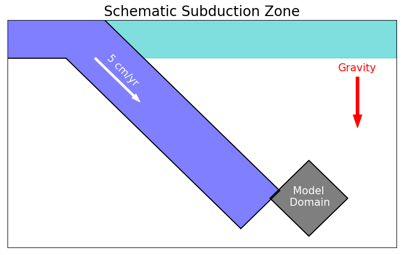
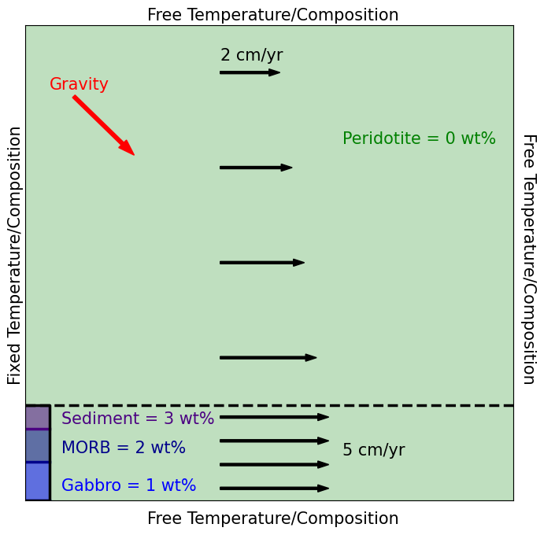
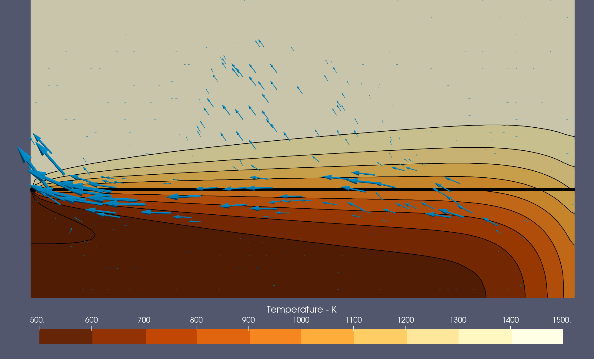
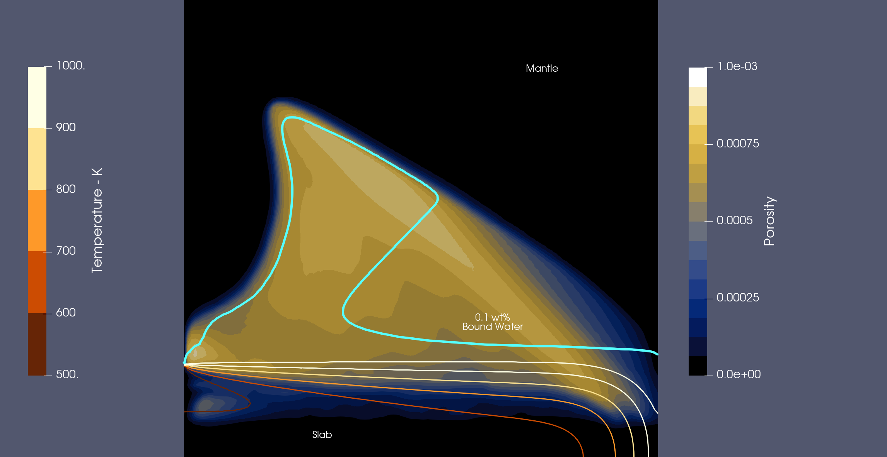
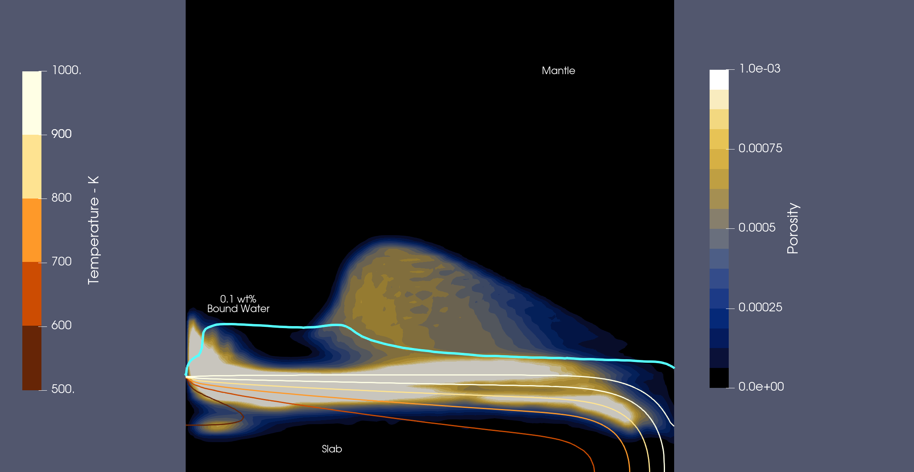

(sec:cookbooks:tian_parameterization_kinematic_slab)=
# Simplified Subduction Model with Parameterized Solid-Fluid Reactions

*This section was contributed by Daniel Douglas.*

In this cookbook we construct a simplified model of subduction which simulates two-phase reactive fluid transport
using an implementation of parameterized phase diagrams from {cite:t}`tian_et_al_2019`. The model focuses on the
slab-mantle interface for a slab with a kinematically prescribed convergence rate of 5 cm/yr and a constant dip of
45 degrees. The model domain is 100 km x 100 km, with the x-axis aligned parallel to the slab surface, and the
y-axis aligned orthogonal to the slab surface. To achieve a dipping slab in a 2D Cartesian box, the gravity vector
is oriented at an angle of 45 degrees from vertical. With the exception of the left boundary, the temperature (1500
K) and composition (peridotite) at the start of the model is uniform. On the left boundary, the temperature is 1500
K for y > 20 km (mantle wedge), and for y <= 20 km (slab) the temperature varies linearly from 400 K to 600 K.
For the composition on the left boundary, for y > 20 km the composition is peridotite, and for y <= 20 km, the slab
is imposed with a layered composition consisting of 5 km of sediment, 7 km of mid-ocean ridge basalt (MORB), and 8 km
of gabbro. For numerical stability, the slab is dry for t <= 100 kyr. For t > 100 kyr, the incoming lithologies on
the left boundary become hydrated, carrying 3 wt% water in sediment, 2 wt% water in MORB, and 1 wt% water in gabbro.
The boundary velocities are all kinematically prescribed, for 0 <= y <= 20 km, the velocity is set to 5 cm/yr, and
for y > 20 km the velocity linearly decreases from 5 cm/yr at the slab surface to 2 cm/yr at the top boundary. A
schematic diagram showing where the model is in the context of a generic subduction zone is shown in {numref}`fig:schematic-diagram-overview`, and a schematic diagram of the model setup is shown in {numref}`fig:schematic-diagram-model`

:::{note}
The low fluid viscosity and high contrast in density between the solid and fluid phases leads to large fluid
velocities on the order of m/yr. Combined with the need for high resolution around the fluid to resolve compaction
viscosity gradients means that this cookbook requires more computational resources than some other cookbooks within
ASPECT. In detail, this simulation was run on 128 processors for approximately 2 hours.
:::

```{figure-md} fig:schematic-diagram-overview


Schematic diagram showing the model region of a subduction zone, and the actual schematic diagram of the model.
```

```{figure-md} fig:schematic-diagram-model


Schematic diagram showing the model design.
```

## The input file
This cookbook includes two input files, one which advects the porosity (free fluid) compositional field through the
darcy velocity, and one which advects the porosity compositional field according to the fluid velocities obtained by solving the fully coupled two-phase flow system of equations. Both models feature dehydration and rehydration reactions using the Tian parameterization and both input files can be found at [cookbooks/tian_parameterization_kinematic_slab](https://www.github.com/geodynamics/aspect/blob/main/cookbooks/tian_parameterization_kinematic_slab/). One
important problem in models that track the partitioning of fluid into/out of a solid phase is that these
interactions can be much faster than the time step of the model. To model these type of processes, ASPECT uses
operator splitting (see also {ref}`sec:benchmark:operator-splitting`): Reactions are solved on a different time
scale than advection. For this model, this means that at the beginning of each time step, all hydration/dehydration
reactions are solved using several shorter sub-time steps. In the input file, we have to choose both the size of
these sub-time steps and the rate (or characteristic time scale) of the solid-fluid reactions, which must be
consistent in the sense that the operator splitting time step can not be larger than the reaction time scale. We
choose a conservative value for the fluid-solid reaction time scale of 50 kyr for model stability and computational
efficiency. For a production model one would likely want to reduce this value to be as low as possible without
affecting model convergence, since in reality the timescale for the fluid-solid reactions is likely much lower than
the advection time step. For example, at 573 K it has been estimated that to fully serpentinize a 1 km line of
mantle would take ~ 10 kyr, and this timescale seems to decrease with increasing temperature {cite:t}`macdonald_fyfe_1985`. However, smaller time scales would lead to very large changes in porosity that make the
nonlinear solver converge less reliably unless much smaller advection time steps/higher resolution are enforced.

## Model Evolution
As the slab 'subducts' across the base of the model, the hot ambient mantle heats the slab leading to progressive
dehydration of the lithologies through time. By the time the model terminates, most of the sediment layer is
dehydrated and the MORB layer is in the process of dehydrating. In the single-phase model, once free fluid is
generated its velocity is dictated by Darcy's law, which due to the large density contrast between the solid and
the fluid results in fluid pathways that are largely parallel to gravity, with some deflection due to the down-dip
velocity of the solid. The high viscosity within the slab does not inhibit the development of fluid pathways, so
once free fluid is generated, it escapes the slab directly into the mantle wedge, hydrating the mantle peridotite in
the process. In the coupled two-phase model, model evolution is drastically changed by the effects of the solid on
the fluids. Initially, free fluid from the dehydration of the subducting lithologies is trapped within the slab due
to the large compaction viscosities. This trapped fluid at first flows up-dip within the slab, until 1 Myr into
model evolution when fluid pathways breach the slab surface and begin migrating through the mantle wedge. However,
the extent of mantle hydration is significantly reduced in the fully coupled case relative to the uncoupled case, as
can be seen by the 0.1 wt% bound water content in {numref}`fig:uncoupled-diagram` and {numref}`fig:coupled-diagram`.
This result showcases that fully coupling the solid and fluid phases can lead to drastically different model
outcomes, and whether it is appropriate to neglect this coupling needs to be considered when constructing models of
two-phase reactive fluid transport.

```{figure-md} fig:temperature-velocity


The temperature field at the end of model time for the fully coupled case. Blue vectors are scaled by the magnitude of the fluid velocity and orientated by the direction of fluid flow and highlights the migration of the fluid up-dip within the slab. The region beneath the thick horizontal black line is where the slab is imposed within the model.
```

```{figure-md} fig:uncoupled-diagram


The distribution of free fluid (porosity) in the model when the solid and fluid phase are not fully coupled. Region
where there is 0.1 wt% bound water in the solid is shown with the thick cyan contour. Brown - Yellow contours show
isotherms between 500 - 1000 K at 100 K intervals.
```

```{figure-md} fig:coupled-diagram


The distribution of fluids in the model when the solid and fluid phase are fully coupled. Region where there is 0.1
wt% bound water in the solid is shown with the thick cyan contour. Brown - Yellow contours show isotherms between
500 - 1000 K at 100 K intervals.
```

## Extending the Model
There are several parameters which heavily influence the solid-fluid interactions within this cookbook. Here are
some ideas for varying the model setup to explore the influence of these parameters:

-   Changing the layering of the lithologies in the slab: The 4 lithologies parameterized by Tian et al., 2019
behave differently through P-T space, and changing the thicknesses of these layers in the slab will control the
location and the rate of dehydration.
-   Changing the thermal structure: The temperature used in this cookbook is very simplified, and assumes a very
cold slab to prevent large amounts of dehydration at the start of the model. Making the slab warmer and imposing an
adiabatic temperature in the ambient mantle would not only change when the slab dehydrates, but also how much water
can partition into the peridotite mantle.
-   Changing the dip and convergence rate: We assume a 45 degree slab dip and a convergence rate of 5 cm/yr. Varying
this dip will impact the magnitude of the slab-orthogonal component of gravity which has a large control on the
fluid pathways. Varying the convergence rate will influence how much heat is able to conduct from the mantle into
the slab and affect the timing of dehydration.

It is worth reiterating that to extend this model towards a production simulation, the nonlinear solver tolerance
should be stricter (at least 1e-5), and reaction rates should be reduced. This cookbook serves as a base model
that showcases the use of tian approximation in the reactive two-phase fluid material model, and these
simplifications were made in this cookbook to make the model more user-friendly.
