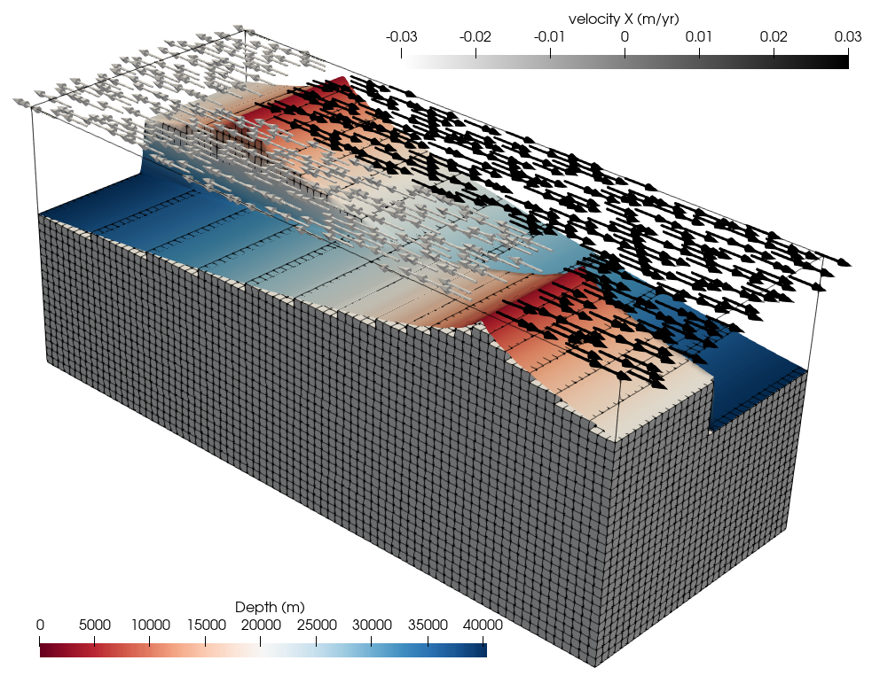
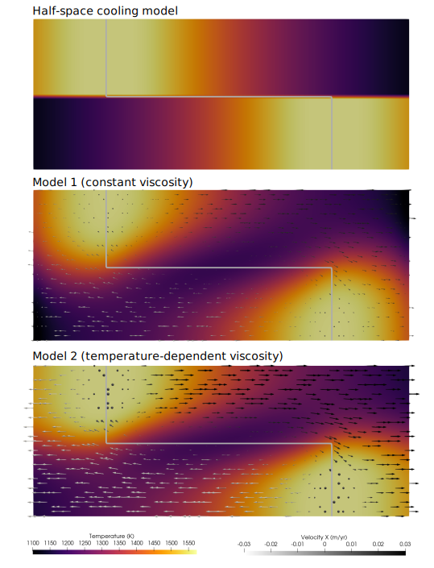
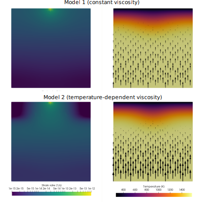

(sec:cookbooks:transform-fault-world-builder)=
# Using the World Builder to model the thermal structure of oceanic transform faults

*This section was contributed by Juliane Dannberg.*

The input file for this model can be found at
[cookbooks/transform_fault_behn_2007/transform_fault_behn_2007.prm](https://www.github.com/geodynamics/aspect/blob/main/cookbooks/transform_fault_behn_2007/transform_fault_behn_2007.prm)

Note that this model may take a few hours to run on a laptop because it is
a 3D model that runs for a large number of time steps.

This model features the spreading of an oceanic plate away from a mid-ocean
ridge, with the ridge axis being segmented by a transform fault. The setup is
taken from {cite:t}`behn:transform:fault` and features a box that is 250 km
wide, 100 km across, and 100 km in depth. Both oceanic plates move away from
the ridge with a velocity of 3 cm/yr, giving a full spreading rate of 6 cm/yr.
To achieve this, the velocity is fixed at the top boundary. Material flows in from the
bottom, and then leaves the domain at the two sides perpendicular to the
spreading direction. The bottom, left and right boundaries are therefore open,
prescribing the lithostatic pressure as a boundary condition, whereas the front
and back boundaries (parallel to the spreading direction) are (closed) free-slip
boundaries. The model ignores buoyancy effects and is therefore fully driven by
the boundary conditions.
The initial temperature follows a half-space cooling model for each of the two
ridge segments, created by the Geodynamic World Builder. Adiabatic heating and
shear heating are not enabled. The figure below shows the initial temperature
distribution.

```{figure-md} fig:transform-fault


 Setup of the transform fault model. Background colors show depth of the 1500 K isotherm, arrows illustrate the velocity. The mesh is shown in the bottom part of the model.
```

## Creating the initial temperature with the Geodynamic World Builder

The initial thermal structure of the model should follow a half-space cooling
model for each of the two ridge segments. The easiest way of creating this
temperature distribution is to use the Geodynamic World Builder, which allows
us to define features such as oceanic plates together with the desired thermal
structure. Since the Geodynamic World Builder is included in the ASPECT
installation, we only need to create an input file for the World Builder and
then our thermal structure will be generated as part of the model run. For
details on how to create this Geodynamic World Builder input file, see the
[corresponding tutorial](https://gwb.readthedocs.io/en/latest/user_manual/cookbooks/3d_cartesian_transform_fault/doc/README.html)
in the Geodynamic World Builder manual.

In the .prm file for ASPECT, we just have to make sure that we set this file
as the `World builder file`, that we use `world builder' as our initial
temperature models and that our material properties are consistent between
the two files. Specifically, we here want to make sure that the surface
temperature and the adiabatic/mantle potential temperature are the same.

```{literalinclude} temperature.part.prm
```

Since the thermal structure is computed according to the half-space cooling
model, we also need to ensure that we use the same thermal diffusivity as in
the Geodynamic World Builder input file:

```{literalinclude} material.part.prm
```
Note that the thermal expansivity is set to zero because thermal buoyancy is
ignored in {cite:t}`behn:transform:fault`.

We here present two cases following {cite:t}`behn:transform:fault`:
Case 1, which has a constant viscosity, and case 2, which has a
temperature-dependent viscosity. The full input files can be found at
[cookbooks/transform_fault_behn_2007/transform_fault_behn_2007.prm](https://www.github.com/geodynamics/aspect/blob/main/cookbooks/transform_fault_behn_2007/transform_fault_behn_2007.prm) and

[cookbooks/transform_fault_behn_2007/temperature_dependent.prm](https://www.github.com/geodynamics/aspect/blob/main/cookbooks/transform_fault_behn_2007/temperature_dependent.prm).


## Thermal structure at the end of the model run.

We run the models for 10 million years and then evaluate the thermal structure.
Specifically, we here show a comparison to Figures 3 and 4 in
{cite:t}`behn:transform:fault`.

```{figure-md} fig:transform-fault-20-km-depth


Thermal structure at 20 km depth for the initial state (top), the final state of the
model with constant viscosity (middle) and the model with a temperature-dependent
viscosity (bottom). Gray line indicates the location of the plate boundary. Arrows
illustrate the flow field.
```

```{figure-md} fig:transform-fault-vertical-slice


Thermal structure in a vertical slice through the center of the transform fault at
the final state of the model with constant viscosity (top) and the model with a
temperature-dependent viscosity (bottom). Left column shows the strain rate, right
column shows the temperature distribution. Black arrows illustrate the flow field.
```

The temperature-dependent viscosity reduces the temperature and focuses the
upwelling below the transform fault, leading to more deformation in that region.
