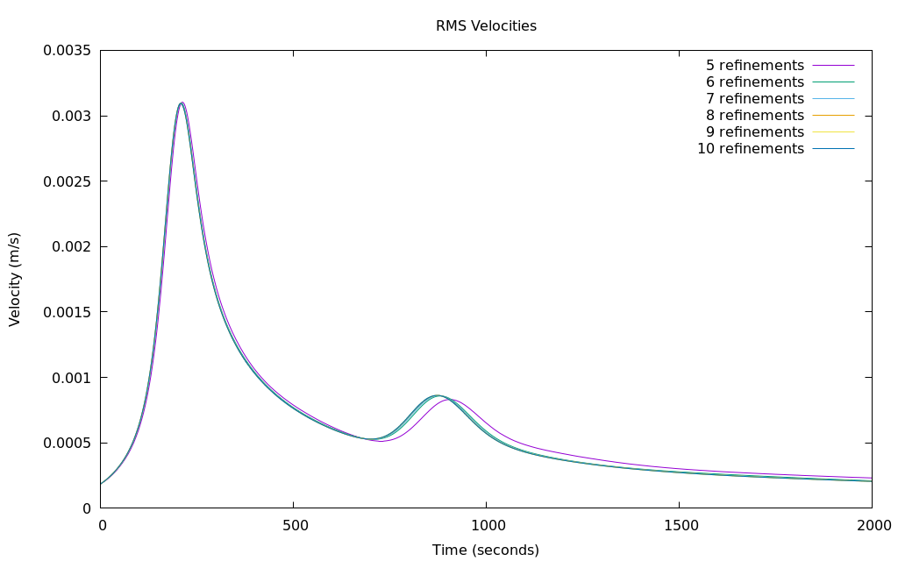
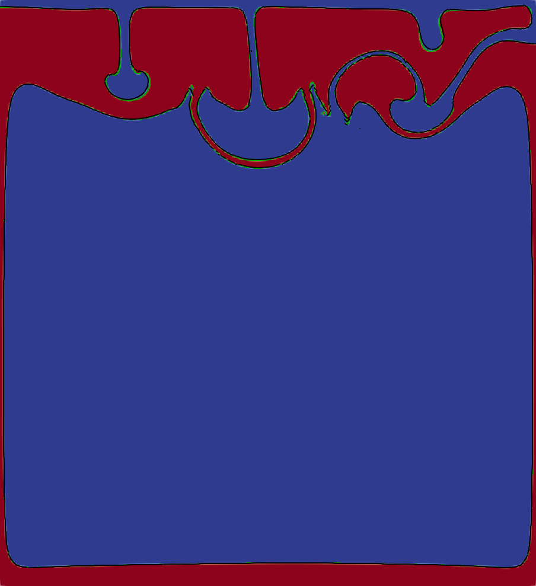
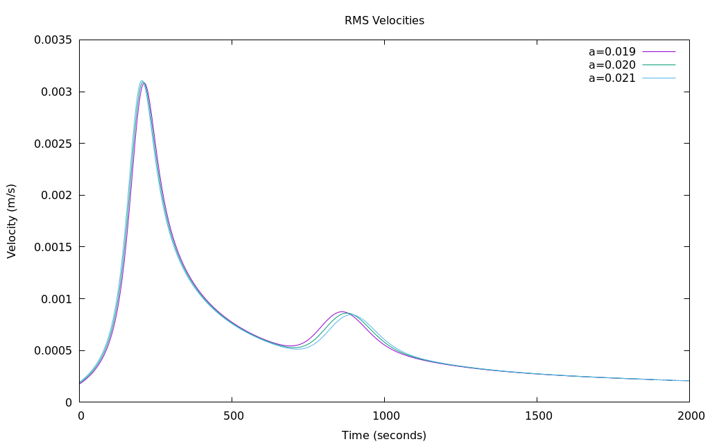

# Computation of the van Keken Problem with the Volume-of-Fluid Interface Tracking Method

*This section is a co-production of Jonathan Robey and E. G. Puckett.*

One can
also model the van Keken problem with the volume-of-fluid (VOF) interface
tracking algorithm in ASPECT. In fact, this problem is particularly well-suited to
being computed with the VOF method, since it consists of two distinct,
immiscible fluids and interface tracking algorithms are specifically designed
not to allow the two fluids to mix. In particular, assuming the computation is
sufficiently well-resolved, the fluids will not mix at sub-grid scales over
the entire duration of the computation. However, note that this implies that
all computations of the van Keken problem made with the VOF method must
necessarily be with discontinuous initial conditions. Finally, since one is
often interested in a high resolution image of the shape of the interface
between the two fluids, one can use the output of the VOF method to examine
the interface within individual cells or within regions consisting of groups
of cells.

Another advantage the VOF method has over modeling moving interface problems
with compositional fields is that for problems in which the interface occupies
a relatively small part of the computational domain, all of the computational
work in the VOF method is done in cells that lie in a neighborhood of the
interface, rather than in the entire computational domain.

```{figure-md} fig:vof-vk-1


 Evolution of the root mean square velocity as a function of time for computations of the van Keken problem made with the VOF interface tracking algorithm with five different global mesh refinements. Since the VOF initial conditions are discontinuous, the above results should really be compared with the computations with discontinuous initial conditions in {numref}`fig:vk-2a`. However, the above results also compare extremely favorably with the computations with smoothed, continuous initial conditions for the compositional field in {numref}`fig:vk-2b`. As in {numref}`fig:vk-2b`, 5 global refinements correspond to a 32 $\times$ 32 mesh and 10 global refinements correspond to a 1024 $\times$ 1024 mesh.
```

```{figure-md} fig:VOF_van_Keken-02


 The results of two computations of the van Keken problem made with the VOF interface tracking algorithm overlaid upon each other at $t_\text{end}=2000$. This visualization shows the reconstructed boundary between the two materials at the final time $t_\text{end}$ as computed on a uniform grid with 7 and 8 levels of refinement. The boundaries between the materials are displayed as contours of the fields $\tilde{\psi}^7(t_\text{end})$ (black) and $\tilde{\psi}^8\,(t_\text{end})$ (bright green), which are generated by the visualization postprocessor. The contours for the reconstructed material boundaries are superimposed on a color gradient visualization of the material composition for the computation with 8 levels of refinement in order to make the regions with each fluid type more evident. Compare with {numref}`fig:vk-1d`.
```

As noted above, when the interface is discontinuous, the van Keken problem is
a version of the Rayleigh-Taylor problem, which is unstable to perturbations
of all wavelengths whether the two fluids have the same viscosity or different viscosities (e.g. see {cite:t}`chandrasekhar:1961`). Therefore, it is
extremely sensitive to the initial conditions. In order to address this
sensitivity, we do not use the default approach of computing the initial
material volume fractions using a composition quadrature. Instead we compute
the initial volume fractions using a signed distance function $\phi$ as
follows {cite}`robey:2019,robey:puckett:2019`.

First we create the function $\phi$, which has the following two properties: 1)
it is positive in the region that contains one of the fluids, which we will
refer to as fluid&nbsp;1, and negative in the complement of this region, which
we will refer to as fluid&nbsp;2, and 2) at each point in the domain the
magnitude $| \phi |$ of $\phi$ is the distance to the boundary between the two
fluids or materials. In the computations shown here, we use an approximation
$\tilde{\phi}$ to $\phi$ such that the difference between $\tilde{\phi}$ and
$\phi$ is small enough for the purposes of making the computations
high-quality. The use of an approximation as opposed to the function itself is
due to obtaining an appropriate function for almost all nontrivial (not a line
or a circle) boundaries is extremely difficult. In this case, because the
boundary is close to horizontal, we use the vertical distance to the boundary
based on the argument that the gradient will not differ sufficiently from $1$
to induce errors in the initialization computation. The primary advantage of
choosing this particular initialization algorithm is that it allows us to more
accurately reproduce the initial condition on a sub-grid scale than would
otherwise be possible on the coarser grid on which we compute the time
evolution of the interface.

```{literalinclude} main.part.prm
```

The relevant sections of the parameter file for this type of initialization of
the VOF method appears immediately above. In particular, the combination of
`Number of initialization samples` with the `level set` initialization type
indicates that our initialization will consist of dividing each grid cell into
$16 \times 16$ subcells and the distance to the given initial interface
$f(\mathbf x)$, provided in `Function expression`, is computed in each of the
256 subcells. We then use this information to compute a piecewise linear
interface approximation to $f(\mathbf x)$. The volume fraction in each subcell
is then found in the manner described in {cite:t}`robey:2019,robey:puckett:2019`). This initialization procedure provides a much finer and thus, more
accurate, initial condition than the standard VOF initialization procedure
described above.

While the visualization configuration in a typical parameter file is
sufficient for most purposes, when using the VOF method one has the ability to
see the division between the fluids reconstructed by the VOF algorithm in each
cell. This is accomplished by plotting the zero contour of a field
$\tilde\psi$ that is generated to be $0$ on the reconstructed interface,
positive in the region with fluid&nbsp;1, and negative in the region with
fluid&nbsp;2. However $\tilde{\psi}$ does not satisfy the requirement that the
magnitude is equal to the distance to the interface as would be required for
the signed distance function $\phi$. The modifications to the parameter file
that are necessary in order to draw the reconstructed boundary as a contour
are shown immediately below. The full configuration file for this version of
the benchmark problem can be found at
[cookbooks/van-keken-vof/van-keken-vof.prm](https://www.github.com/geodynamics/aspect/blob/main/cookbooks/van-keken-vof/van-keken-vof.prm).

```{literalinclude} postprocess.part.prm
```

We made a number of computations of the van Keken problem with the VOF method
in order to compare the wall clock times with computations using a DG
compositional field. We ran both on the same cluster at global refinements
5--8 using one node with four CPUs and refinements 9 and 10 using two
nodes with 16 CPUs. Our results are shown in {numref}`tab:vof-runtime-comparison-table`. In all of the
computations shown in {numref}`tab:vof-runtime-comparison-table` we used a CFL number of $\sigma=0.5$.
Due to the change in the CFL number from $\sigma = 1.0$ in
{numref}`tab:runtime-table` to $\sigma = 0.5$ in {numref}`tab:vof-runtime-comparison-table`
and the difference between HPC clusters on which the computational results
shown in the two tables were made, we can't make a direct quantitative
comparison between the data in {numref}`tab:runtime-table`
and {numref}`tab:vof-runtime-comparison-table`.

However, we can compare the required run time for a VOF computation to that
for a DG computation. We note that the use of the VOF advection algorithm
significantly reduces the required computation time in all cases, frequently
requiring less than half the time required by the DG compositional field.

We now examine the RMS velocity data shown in {numref}`fig:vof-vk-1`. Other than
for the case of 5 levels of uniform global refinement, the curves for the RMS
velocities for $6$, $7$, $8$, $9$ and $10$ levels of refinement in {numref}`fig:vof-vk-1` are nearly indistinguishable.

Upon examining the solution at the final time, we note that the general
structure of the solution shown in {numref}`fig:VOF_van_Keken-02` matches the form and the
general structure found in other versions of this benchmark such as in {numref}`fig:vk-1d`. We also note that the
differences in the shape of the interface based on a single refinement as
shown in {numref}`fig:VOF_van_Keken-02` are minor, although still slightly visible. This is
to be expected as refinement is a perturbation of the initial condition at a
smaller wave length.

:::{admonition} TODO
:class: error

Table title should contain references, however, Sphinx does not appear to support references in table titles at the moment. Original caption:
Comparison of runtimes for the van Keken problem with VOF
    and a DG compositional field, in which the initial conditions for
    DG smoothed are as described in {ref}`sec:benchmarks:vankeken`.  The times shown are for the full
    computation, ending at $t_\text{end} = 2000$ with a CFL number of
    $\sigma=0.5$ in both cases.
    All of these computations were made with ASPECT version 2.2.0-pre
    (master, commit `ef542ecc2`) in release mode on the Peloton2 cluster at
    U.C. Davis. We note that the change in the CFL number $\sigma$ and the
    differing choice of cluster makes a direct quantitative comparison
    between this table and {numref}`tab:runtime-table` invalid due to
    too many confounding factors.
:::


```{table} Comparison of runtimes for the van Keken problem with VOF and a DG compositional field, in which the initial conditions for DG smoothed are as described in the previous section. The times shown are for the full computation, ending at $t_\text{end} = 2000$ with a CFL number of $\sigma=0.5$ in both cases. All of these computations were made with ASPECT version 2.2.0-pre (master, commit 'ef542ecc2') in release mode on the Peloton2 cluster at U.C.Davis. We note that the change in the CFL number $\sigma$ and the differing choice of cluster makes a direct quantitative comparison between this table and the previous one invalid due to too many confounding factors.
:name: tab:vof-runtime-comparison-table

| Global Refinement | Number of Processors |     VOF      |      DG      |
|:-----------------:|:--------------------:|:------------:|:------------:|
|         5         |          4           | 1.33 minutes | 2.57 minutes |
|         6         |          4           | 8.51 minutes | 19.5 minutes |
|         7         |          4           |  1.15 hours  |  2.49 hours  |
|         8         |          4           |  8.53 hours  |  19.6 hours  |
|         9         |          16          | 16.30 hours  |  2.72 days   |
|        10         |          16          |  5.17 days   | \>6.00 days  |

```

The consistency of the results shown here differs noticeably from the behavior
of the problem with discontinuous initial conditions when computed with the
FEM and DG advection algorithms. One possible reason for these differences is
the specialized initialization procedure used for the volume of fluid method,
which permits a much more consistent initialization by reducing the variation
in the initial condition when the initial mesh is refined.

To study this feature of our algorithm and the sensitivity of the problem to
the precise initial condition, we vary the size of the initial interface
perturbation and examine the sensitivity of the final results to a small
change in the initial conditions. Specifically, we vary the amplitude $a$ of
the cosine function in the initial conditions, as shown below.

```{literalinclude} variation.part.prm
```

```{figure-md} fig:vof-vk-3


 Computations of the van Keken problem made with the VOF interface tracking algorithm showing the evolution of the RMS velocity as a function of time for small changes in the amplitude a of the cosine function in the initial condition at 7 levels of refinement. Compare to {numref}`fig:vk-6` and {numref}`fig:vk-9`.
```

In these computations we vary the value of $a$ from its usual value of
$a = 0.02$ to $5\% = 0.001$ below its usual value to $5\%$ above its usual
value in increments of $0.01$. In other words, we compare the values for
$a =0.019$, $0.020$, and $0.021$. Upon examination of {numref}`fig:vof-vk-3`, we
see a visible variation in the location of the second peak, although the
overall shape of the curve remains consistent with the curves in
{numref}`fig:vof-vk-1`. The size of this variation in the initial conditions
cannot be expected to be reproduced using the standard compositional
quadrature initialization procedure for VOF unless the cell size is on the
scale of the change in the value of $a$; i.e.,
$h \, \lessapprox \, \Delta a = 0.001$. We also note that the smoothing
parameter which would produce a $10^{-3}\leq C \leq 1 - 10^{-3}$ band on the
order of the same size as the amplitude variation shown here, would be
approximately $2.8 \cdot 10^{-4}$. This perturbation is much smaller than any
of the changes in width of the smoothed regions in the computations shown in
{numref}`fig:vk-6`. In summary, these results demonstrate the
sensitivity of the discontinuous version of the van Keken problem to even
extremely small variations in the initial conditions.
