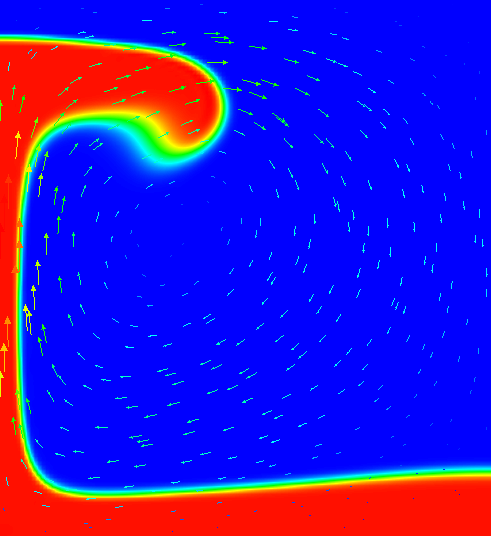
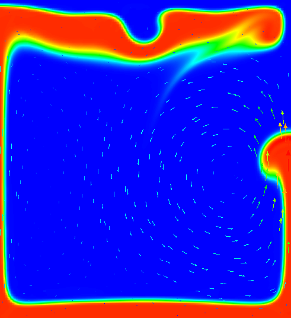
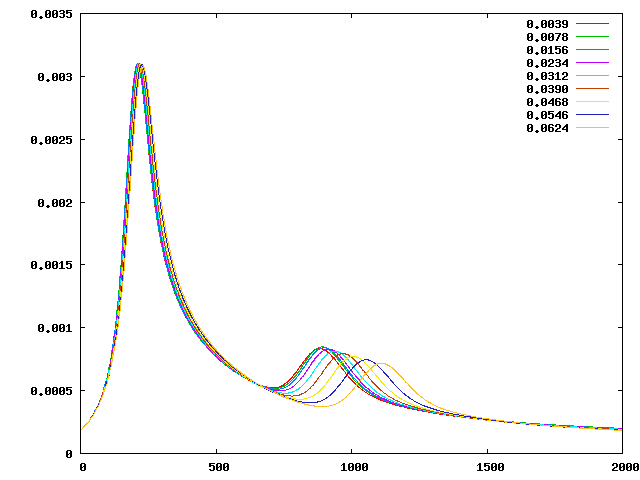
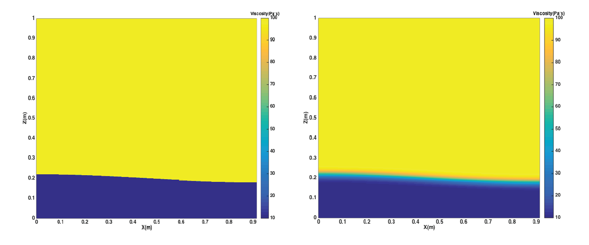

(sec:benchmarks:vankeken)=
# The van Keken thermochemical composition benchmark

*This section is a co-production of Cedric Thieulot, Juliane Dannberg, Timo
Heister and Wolfgang Bangerth with an extension to this benchmark provided by
the Virginia Tech Department of Geosciences class "Geodynamics and
ASPECT" co-taught by Scott King and D. Sarah Stamps.*

One of the most widely used benchmarks for mantle convection codes is the
isoviscous Rayleigh-Taylor case ("case 1a") published by van Keken
*et al.* in {cite:t}`vankeken:etal:1997`. The benchmark considers a 2d situation where
a lighter fluid underlies a heavier one with a non-horizontal interface
between the two of them. This unstable layering causes the lighter fluid to
start rising at the point where the interface is highest. {numref}`fig:vk-1a` -
{numref}`fig:vk-1d` shows a time series of images to illustrate this.


```{figure-md} fig:vk-1a


 Van Keken benchmark (using a smoothed out interface, see the main text): Compositional field at time t=0.
```

```{figure-md} fig:vk-1b


 Van Keken benchmark (using a smoothed out interface, see the main text): Compositional field at time t=300.
```

```{figure-md} fig:vk-1c


 Van Keken benchmark (using a smoothed out interface, see the main text): Compositional field at time t=900.
```

```{figure-md} fig:vk-1d


 Van Keken benchmark (using a smoothed out interface, see the main text): Compositional field at time t=1800.
```

Although van Keken's paper title suggests that the paper is really about
thermochemical convection, the part we examine here can equally be considered
as thermal or chemical convection; all that is necessary is that we describe
the fluid's density. We can do that by using an inhomogeneous initial
temperature field, or an inhomogeneous initial composition field. We will use
the input file in [cookbooks/van-keken/van-keken-discontinuous.prm](https://www.github.com/geodynamics/aspect/blob/main/cookbooks/van-keken/van-keken-discontinuous.prm) as
input, the central piece of which is as follows (go to the actual input file
to see the remainder of the input parameters):

```{literalinclude} main.part.prm
```

The first part of this selects the `simple` material model and sets the
thermal expansion to zero (resulting in a density that does not depend on the
temperature, making the temperature a passively advected field) and instead
makes the density depend on the first compositional field. The second section
prescribes that the first compositional field's initial conditions are 0
above a line describes by a cosine and 1 below it. Because the dependence of
the density on the compositional field is negative, this means that a lighter
fluid underlies a heavier one.

The dynamics of the resulting flow have already been shown in {numref}`fig:vk-1a` - {numref}`fig:vk-1d`.
The measure commonly considered in papers comparing different methods is the
root mean square of the velocity, which we can get using the following block
in the input file (the actual input file also enables other postprocessors):

```{literalinclude} postprocess.part.prm
```

Using this, we can plot the evolution of the fluid's average velocity
over time, as shown in {numref}`fig:vk-2a`. Looking at this
graph, we find that both the timing and the height of the first peak is
already well converged on a simple $32\times 32$ mesh (5 global refinements)
and is very consistent (to better than 1% accuracy) with the results in the
van Keken paper.


```{figure-md} fig:vk-2a


Van Keken benchmark with discontinuous initial conditions for the compositional field: Evolution of the root mean square velocity $\left(\frac 1{|\Omega|}\int_\Omega |\mathbf u(\mathbf x,t)|^2 \; \text{d}x\right)^{1/2}$ as a function of time for different numbers of global mesh refinements. 5 global refinements correspond to a $32\times 32$ mesh, 9 refinements to a $512\times 512$ mesh.
```

```{figure-md} fig:vk-2b


Van Keken benchmark with smoothed, continuous initial conditions for the compositional field: Evolution of the root mean square velocity $\left(\frac 1{|\Omega|}\int_\Omega |\mathbf u(\mathbf x,t)|^2 \; \text{d}x\right)^{1/2}$ as a function of time for different numbers of global mesh refinements. 5 global refinements correspond to a $32\times 32$ mesh, 9 refinements to a $512\times 512$ mesh.
```

That said, it is startling that the second peak does not appear to converge
despite the fact that the various codes compared in {cite:t}`vankeken:etal:1997` show
good agreement in this comparison. Tracking down the cause for this proved to
be a lesson in benchmark design; in hindsight, it may also explain why van
Keken *et al.* stated presciently in their abstract that "*...good
agreement is found for the initial rise of the unstable lower layer; however,
the timing and location of the later smaller-scale instabilities may differ
between methods.*" To understand what is happening here, note that the
first peak in these plots corresponds to the plume that rises along the left
edge of the domain and whose evolution is primarily determined by the
large-scale shape of the initial interface (i.e., the cosine used to describe
the initial conditions in the input file). This is a first order deterministic
effect, and is obviously resolved already on the coarsest mesh shown used. The
second peak corresponds to the plume that rises along the right edge, and its
origin along the interface is much harder to trace -- its position and
the timing when it starts to rise is certainly not obvious from the initial
location of the interface. Now recall that we are using a finite element field
using continuous shape functions for the composition that determines the
density differences that drive the flow. But this interface is neither aligned
with the mesh, nor can a discontinuous function be represented by continuous
shape functions to begin with. In other words, we may *input* the initial
conditions as a discontinuous functions of zero and one in the parameter file,
but the initial conditions used in the program are in fact different: they are
the *interpolated* values of this discontinuous function on a finite element
mesh. This is shown in {numref}`fig:vk-3`. It is obvious that these initial
conditions agree on the large scale (the determinant of the first plume), but
not in the steps that may (and do, in fact) determine when and where the
second plume will rise. The evolution of the resulting compositional field is
shown in {numref}`fig:vk-4` and it is obvious that the second, smaller plume
starts to rise from a completely different location -- no wonder the
second peak in the root mean square velocity plot is in a different location
and with different height!

```{figure-md} fig:vk-3


 Van Keken benchmark with discontinuous initial conditions for the compositional field: Initial compositional field interpolated onto a $32\times 32$ (left) and $64\times 64$ finite element mesh (right).
```

```{figure-md} fig:vk-4


 Van Keken benchmark with discontinuous initial conditions for the compositional field: Evolution of the compositional field over time on a $32\times 32$ (first and third column; left to right and top to bottom) and $64\times 64$ finite element mesh (second and fourth column). Pictures next to each other illustrate how critically the rise of the second plume depends on the mesh resolution, starting at around time $t=350$.
```

The conclusion one can draw from this is that if the outcome of a
computational experiment depends so critically on very small details like the
steps of an initial condition, then it's probably not a particularly
good measure to look at in a benchmark. That said, the benchmark is what it
is, and so we should try to come up with ways to look at the benchmark in a
way that allows us to reproduce what van Keken *et al.* had agreed upon. To
this end, note that the codes compared in that paper use all sorts of
different methods, and one can certainly agree on the fact that these methods
are not identical on small length scales. One approach to make the setup more
mesh-independent is to replace the original discontinuous initial condition
with a smoothed out version; of course, we can still not represent it exactly
on any given mesh, but we can at least get closer to it than for discontinuous
variables. Consequently, let us use the following initial conditions instead
(see also the file [cookbooks/van-keken/van-keken-smooth.prm](https://www.github.com/geodynamics/aspect/blob/main/cookbooks/van-keken/van-keken-smooth.prm)):

```{literalinclude} smooth.part.prm
```

This replaces the discontinuous initial conditions with a smoothed out version
with a half width of around 0.01. Using this, the root mean square plot now
looks as shown in {numref}`fig:vk-2b`. Here, the second peak
also converges quickly, as hoped for.

The exact location and height of the two peaks is in good agreement with those
given in the paper by van Keken *et al.*, but not exactly where desired (the
error is within a couple of per cent for the first peak, and probably better
for the second, for both the timing and height of the peaks). This has to do
with the fact that they depend on the exact size of the smoothing parameter
(the division by 0.02 in the formula for the smoothed initial condition).
However, for more exact results, one can choose this half width parameter
proportional to the mesh size and thereby get more accurate results. The point
of the section was to demonstrate the reason for the lack of convergence.

## Extension to an adaptive smoothing lengthscale.

*In this section we extend the van Keken cookbook, following up on the work
previously completed by Cedric Thieulot, Juliane Dannberg, Timo Heister and
Wolfgang Bangerth. This section was contributed by Grant Euen, Tahiry
Rajaonarison, and Shangxin Liu as part of the Geodynamics and ASPECT class at
Virginia Tech.*

As already mentioned above, using a half width parameter proportional to the
mesh size allows for more accurate results. We test the effect of the half
width size of the smoothed discontinuity by changing the smoothing parameter
to values proportional to the mesh size. In the formula for the smoothed
initial conditions, this parameter is the division by 0.02. We use 7 global
refinements because the root mean square velocity converges at greater
resolution while keeping average runtime around 5 to 25 minutes. These
runtimes were produced by the BlueRidge cluster of the Advanced Research
Computing (ARC) program at Virginia Tech. BlueRidge is a 408-node Cray CS-300
cluster; each node outfitted with two octa-core Intel Sandy Bridge CPUs and 64
GB of memory. Average runtimes for global refinements 5 through 10 using one
node can be seen in {numref}`tab:runtime-table`. For 7 global refinements
(128$\times$ 128 mesh size), the size of the mesh is 0.0078
corresponding to a half width parameter of 0.0039. The smooth model allows for
much better convergence of the secondary plumes, although they are still more
scattered than the primary plumes.

```{table} *Average runtimes for the van Keken Benchmark with smoothed initial conditions. These times are for the entire computation, a final time step number of 2000. All of these tests were run using ASPECT version 1.3 in release mode, and used different numbers of processors on one node on the BlueRidge cluster of ARC at Virginia Tech.*
:name: tab:runtime-table

|             |                      |                  |              |               |
|:-----------:|:--------------------:|:----------------:|:------------:|:-------------:|
|   Global    | Number of Processors |                  |              |               |
| Refinements |          4           |        8         |      12      |      16       |
|      5      |     28.1 seconds     |   19.8 seconds   | 19.6 seconds | 17.1 seconds  |
|      6      |     3.07 minutes     |   1.95 minutes   | 1.49 minutes | 1.21 minutes  |
|      7      |    23.33 minutes     |  13.92 minutes   | 9.87 minutes | 7.33 minutes  |
|      8      |      3.08 hours      |    1.83 hours    |  1.30 hours  | 56.33 minutes |
|      9      |      1.03 days       |   15.39 hours    | 10.44 hours  |  7.53 hours   |
|     10      |   More than 6 days   | More than 6 days |  3.39 days   |   2.56 days   |

```

This convergence is due to changing the smoothing parameter, which controls
how much of the problem is smoothed over. As the parameter is increased the
smoothed boundary grows; as the smoothed boundary shrinks it becomes sharper
until the original discontinuous behavior is revealed. As the boundary grows,
the two distinct layers eventually become one large, transitioning layer.
These effects can be seen in {numref}`fig:vk-5`. The overall effect is that the
secondary rise is at different times based on these conditions. In general, as
the smoothing parameter is decreased the smoothed boundary shrinks, and the
plumes rise more quickly. As it is increased the boundary grows, and the
plumes rise more slowly. This trend can be used to force a more accurate
convergence from the secondary plumes.

```{figure-md} fig:vk-5


Van Keken Benchmark using smoothed out interface at 7 global refinements: compositional field at time t=0 using smoothing parameter size: a) 0.0039, b) 0.0078, c) 0.0156, d) 0.0234, e) 0.0312, f) 0.0390, g) 0.0468, h) 0.0546, i) 0.0624.
```

The evolution in time of the resulting compositional fields ({numref}`fig:vk-6`)
shows that the first peak converges as the smoothed interface decreases. There
is a good agreement for the first peak for all smoothing parameters. As the
width of the discontinuity increases, the second peak rises more slowly and
later in the run.

```{figure-md} fig:vk-6


 Van Keken benchmark with smoothed initial conditions for the compositional field using 7 global refinements for different smoothing parameters. Number of the time step is shown on the x-axis, while root mean square velocity is shown on the y-axis.
```

Now let us further add a two-layer viscosity model to the domain. This is done
to recreate the two nonisoviscous Rayleigh-Taylor instability cases
("cases 1b and 1c") published in van Keken *et al.* in {cite:t}`vankeken:etal:1997`. Let's assume the viscosity value of the upper, heavier layer
is $\eta_{t}$ and the viscosity value of the lower, lighter layer is
$\eta_{b}$. Based on the initial constant viscosity value 1$\times10^{2}$
Pa&nbsp;s, we set the viscosity proportion
$\frac{\eta_{t}}{\eta_{b}}=0.1, 0.01$, meaning the viscosity of the upper,
heavier layer is still 1$\times10^{2}$ Pa&nbsp;s, but the viscosity of the
lower, lighter layer is now either 10 or 1 Pa&nbsp;s, respectively. The
viscosity profiles of the discontinuous and smooth models are shown in
{numref}`fig:vk-7`.

```{figure-md} fig:vk-7


 Van Keken benchmark using different-viscosity layers. The left image is the discontinuous case, while right is the smooth. Both are shown at $t=0$.
```

For both cases, discontinuous and smooth, and both viscosity proportions, 0.1
and 0.01, the results are shown at the end time step number, $t=2000$, in
{numref}`fig:vk-8`. This was generated using the original input parameter file,
running the cases with 8 global refinements, and also adding the two-layer
viscosity model.

```{figure-md} fig:vk-8


Van Keken benchmark two-layer viscosity model at final time step number, t=2000. These images show layers of different compositions and viscosities. Discontinuous cases are the left images, smooth cases are the right. The upper images are $\frac{\eta_{t}}{\eta_{b}}=0.1$, and the lower are $\frac{\eta_{t}}{\eta_{b}}=0.01$.
```

Compared to the results of the models using constant viscosity throughout the
domain, the plumes rise faster when adding the two-layer viscosity. Also, the
larger the viscosity difference is the earlier the plumes appear, and the
faster their ascent. To further reveal the effect of the two-layer viscosity
model, we also plot the evolution of the fluids' root mean square
velocity over time, as shown in {numref}`fig:vk-9`.

```{figure-md} fig:vk-9


 Van Keken benchmark: Evolution of the root mean square velocity as a function of time for different viscosity contrast proportions (0.1/0.01) for both discontinuous and smooth models.
```

We can observe that when the two-layer viscosity model is added, there is only
one apparent peak for each case. The first peaks of the 0.01 viscosity
contrast tests appear earlier and are larger in magnitude than those of 0.1
viscosity contrast tests. There are no secondary plumes and the whole system
tends to reach stability after around 500 time steps.
