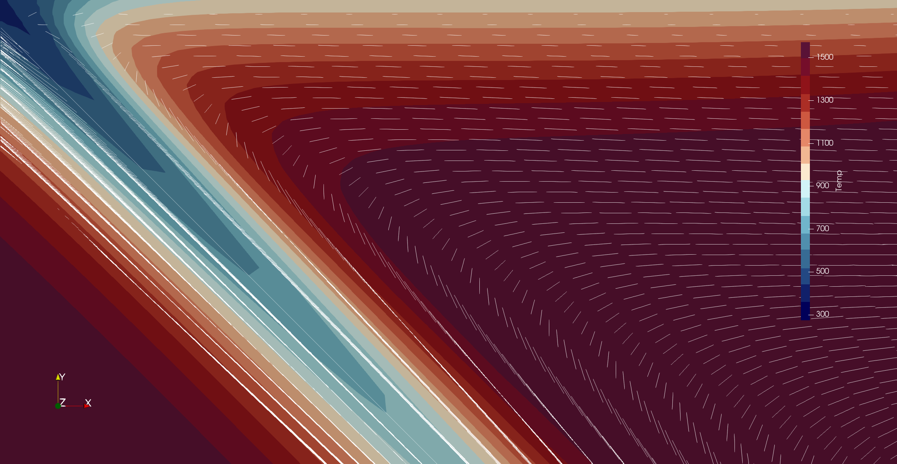
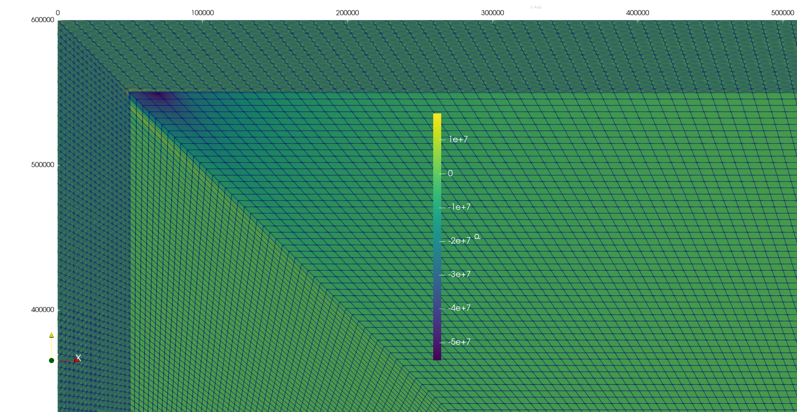

# Van Keken 2008 corner flow recreation

*This section was contributed by Daniel Douglas, Cedric Thieulot, Wolfgang Bangerth, and Max Rudolph.*

This cookbook recreates a 2D corner flow style subduction model as outlined in {cite:t}`vankeken:etal:2008`. Since
ASPECT uses a rectangular mesh by default, the constraints imposed by this problem (i.e prescribing internal
velocities along the dipping slab and zero velocity in the overriding plate) produces unstable Stokes solver
convergence behavior and an unstable pressure solution. To circumvent this issue, a custom mesh with a $Q_2\times
Q_1$ discretization was designed that allows cell edges to align with the internal boundaries defining where
internal velocities within the subducting plate are assigned {numref}`fig:vanKeken-pressure`. Further efforts to
confirm that this setup can accurately reproduce the results of the {cite:t}`vankeken:etal:2008` benchmark should be
done to move this from the cookbook section to the benchmark section.

The model prescribes a 5 cm/yr convergence rate at a subduction angle of 45 degrees along the left boundary and the
interface between the subducting plate, the overriding plate, and the mantle wedge. In the overriding plate, the
velocity is constrained to be 0 cm/yr. The Stokes equations are solved in the mantle wedge, and the right and bottom
boundaries are open to ensure mass conservation.

The half space cooling model prescribed on the left boundary is advected downdip at the prescribed convergence rate,
creating the slab. The cold slab interacts with the mantle wedge, resulting in a classic corner flow temperature and
velocity field {numref}`fig:vanKeken-velocity`. The geometry of the model requires a very low dynamic pressure in
the corner of the mantle wedge, and with the specialized mesh the pressure field was able to be solved for using a
continuous $Q_2\times Q_1$ discretization {numref}`fig:vanKeken-pressure`. The model proceeds until a steady state
thermal structure is reached for the entire model domain.

```{figure-md} fig:vanKeken-velocity


The temperature field of the subducting slab after ~100 Myr. A half space cooling profile with an age of 50 Myr is
applied to the left boundary, which is advected at a 45 degree angle at a rate of 5 cm/yr within the subducting
plate. White lines show the direction of flow.
```

```{figure-md} fig:vanKeken-pressure


The pressure field in the corner of the mantle wedge, and the mesh required to obtain this solution. With the
default ASPECT mesh, convergence is only obtained with a $Q1\times Q_0$ discretization. The pressure solution shown
is solved using a continuous $Q_2\times Q_1$ discretization, which was made possible with the custom mesh design
used for this cookbook.
```
