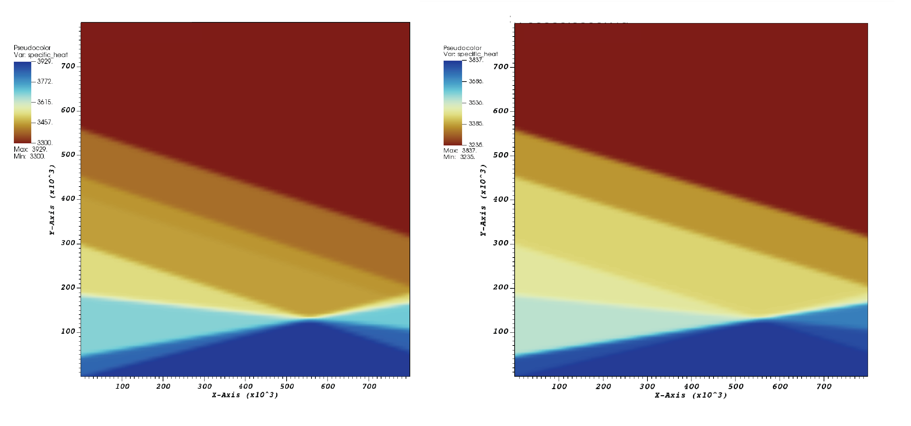
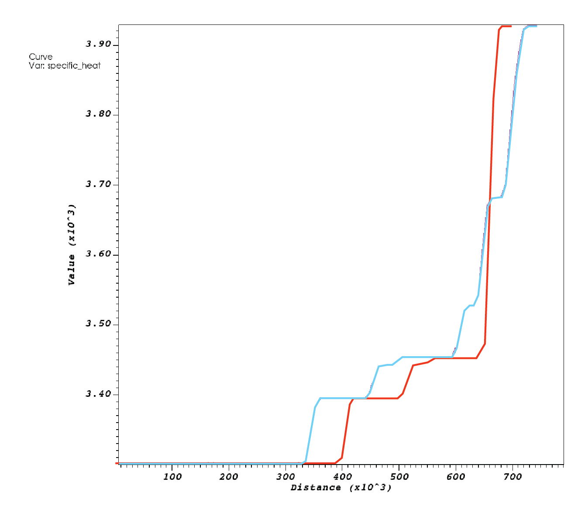

# Visualizing phase diagrams

*This section was contributed by Haoyuan Li and Magali Billen.*

For many models it is useful to see how the material parameters vary as a
function of pressure and temperature. In this cookbook, a plot of material
properties (e.g., density or viscosity) as a function of temperature (x axis)
and pressure (y axis) is referred to as a phase diagram.

In this phase diagram cookbook, phase diagrams are generated from model runs
and visualized with VisIt, but ParaView could also be used to view the same
output. This is a simple way of using the visualization output to check the
correct implementation of phase transitions in a material model. The idea lies
in using a model with an initial temperature that increases linearly along the
$x$-axis and a pressure that changes linearly along the $y$-axis in a box
geometry, so that the two axes, $x$ and $y$, can be interpreted as axes for
pressure and temperature in the graphical output. Here, we visualize a diagram
of the phase transitions implemented in the visco plastic material model, as
well as a lookup table in the Steinberger material model.

## The input file

You can find the input file to run this cookbook example in
[cookbooks/visualizing_phase_diagram/visualizing_phase_diagram.prm](https://www.github.com/geodynamics/aspect/blob/main/cookbooks/visualizing_phase_diagram/visualizing_phase_diagram.prm). For
this first case, phase transitions are prescribed manually in terms of their
depth, Clapeyron slope, and other key parameters.

The model domain is 800 km by 800 km box. Initial temperature increases from
273&nbsp;K on the left side to 2273&nbsp;K on the right side. Pressure, on the
other hand, increases from the top of the box to the bottom with a constant
gradient. This is assured by assigning a constant density with zero
expansivity. It differs from a classic phase diagram only in the direction of
pressure increase.

Two compositions of pyrolite and harzburgite are included in the model. With
each run, only one composition is assigned to the whole domain in order to
visualize the diagrams of these two separately.

The material model is then set up to mimic mantle phase transitions at 410,
520, and 660&nbsp;km. Details of phase transitions are taken from {cite:t}`billen:arredondo:2018`.
A trick is needed to make this work: we assign the values of
the density to the field of heat capacity in the input file. To do this, We
use the phase inputs implemented in the visco plastic plug-in. This serves the
goal of visualizing values of reference densities of phases with the real
density assigned with a constant value in the model. Inputs for this material
model are listed here:

```{literalinclude} material_model.prm
```

## Results

Visualization of the model results yields a phase diagram of a pyrolitic
mantle ({numref}`fig:phase_diagram_ph_density`). The field shown here has the reference densities of the
pyrolite phases, though settings of phase transitions are over-simplified. One
may notice that three transitions (i.e., one in the olivine system, two in the
spinel system) are included for the 660 interfaces, and they need to be
modified at a higher temperature. In spite of the complexities of mantle
phases, the focus of this first example is to simply illustrate this approach
of visualizing it. Beyond showing the diagram, We have also used the
"lineout" feature in VisIt to export the data along two vertical
lines at $T = 1173\text{ K}$ and $T = 1673\text{ K}$ ({numref}`fig:phase_diagram_ph_profile`). The figure
for $T = 1173\text{ K}$ illustrates the buoyancy forces felt by a descending
cold slab within the mantle transition zone.

Next, we shift to harzburgite by changing the values of the initial
compositional field from 0 to 1. For this to occur, the following changes are
needed:

```{literalinclude} harzburgite.prm
```

With this change, we can also visualize the phase diagram of harzburgite in
{numref}`fig:phase_diagram_ph_density`.

Moreover, We tested the pyrolitic lookup table used in the Steinberger material
model ({numref}`fig:phase_diagram_steinberg_density`). The same setup of the initial condition is applied as in
the previous case. The densities, however, are not assigned to the heat
capacity anymore. Thus the vertical axis would deviate from the axis of
pressure a little bit. This second setup serves the goal of illustrating a
more complex and thus more realistic model of phase transitions. Modification
for the material model is listed below:

```{literalinclude} steinberg.prm
```

Compared to the first example, pyrolitic phases are illustrated on a much
finer scale. Meanwhile, we can still tell the phase transitions at 410, 520,
and $660\text{ km}$ depth, respectively, marked by linear boundaries analogous
to a constant Clapeyron slope.

.

```{figure-md} fig:phase_diagram_ph_density


 Visualization of phase diagrams: The field of heat capacity showing values of reference densities for pyrolitic and harzburgitic phases.
```
.

```{figure-md} fig:phase_diagram_ph_profile


 Visualization of phase diagrams: Profiles of pyrolitic density at $T=1173\text{ K}$ (red) and $1673\text{ K}$ (blue).
```

```{figure-md} fig:phase_diagram_steinberg_density


 Visualization of phase diagrams: Density from lookup table of pyrolite from {cite:t}`stixrude:lithgow-bertelloni:2011`.
```
